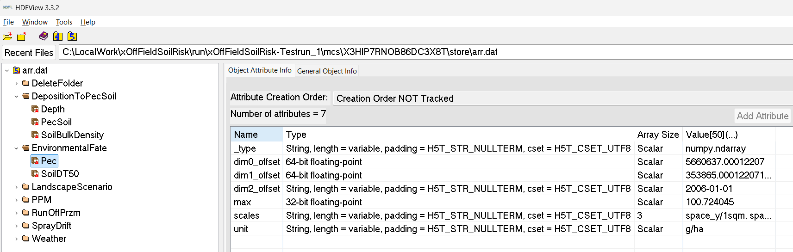

# Get Started

Please contact Sascha Bub ([sascha.bub@rptu.de](mailto:sascha.bub@rptu.de)) or Thorsten Schad ([tschadwork@gmail.com](mailto:tschadwork@gmail.com)) in case of questions.  

## Initial User Group

As described in section [Home/Introduction](../index.md#welcome-to-xofffieldsoilrisk-xsr), the xSR development was initiated due to new requirements in off-field-soil RA in Europe. Accordingly, the initial versions of xSR has a focus on this RA purpose, with and its user groups, namely soil exposure and effect modelling, as well as RA experts. However, as indicated in the [Outlook](../index.md#outlook) section, the intention of the development of xSR is to stepwise facilitate xSR use to broader user groups.  

## Installation

Current xSR model and scenarios are provided for **two technical user level**:  

1. Users with **Github expertise** can directly clone the xSR model and scenarios from the public Github repositories:  

    - [xSR model](https://github.com/xlandscape/xOffFieldSoilRisk)
    - [Scenario NRW-1](https://github.com/xlandscape/Scenario-NRW1)
    - [Scenario NRW-2](https://github.com/xlandscape/Scenario-NRW2)
    - [Scenario NRW-3](https://github.com/xlandscape/Scenario-NRW3)

    Cloning steps vary based on the application being used, eg. [Sourcetree](https://support.atlassian.com/bitbucket-cloud/docs/clone-a-git-repository/) or [Visual Studio Code](https://learn.microsoft.com/en-us/azure/developer/javascript/how-to/with-visual-studio-code/clone-github-repository?tabs=activity-bar).  

2. **Applied modellers in RA or research**: People with expertise in using scientific models but do not work with Github can **download a ready-to-use zip-package** including the xSR model as well as the scenarios her: (xxx(under preparation) landscape.org/xxx)

After cloning the repository or downloading the zip-file (option 2), a user will have everything necessary to start using xSR including sample scenarios and parametrization files.  
Please contact Sascha Bub ([sascha.bub@rptu.de](mailto:sascha.bub@rptu.de)) or Thorsten Schad ([tschadwork@gmail.com](mailto:tschadwork@gmail.com)) in case of questions.  

## Test Run

To start xSR using the sample scenario, **drag *template.xrun* onto *__start\__.bat***.  
This will start an xSR run using the demo parameterisation. The demo parameterisation uses a simple edge-of-field ['Schematic Scenario'](../scenarios/scenarios-examples.md#schematic-scenarios) and Lindane as test substance, without risk mitigation measures. The test run makes use of 3 cpu cores and should not require more than 2 GB memory, as well as about 100 MB disk space. Computing time should be a couple of minutes on current machines.  

**xSR Outputs:**  

| Output Type  | Location      |
|--------------|---------------|
| [Experiment](../reference/xoffFieldSoilRisk-glossary.md#experiment)-level analysis and visualisations  | *\run\xOffFieldSoilRisk-Testrun_1\analysis*  |
| [Monto Carlo (MC)](../reference/xoffFieldSoilRisk-glossary.md#monte-carlo-run) runs analysis and visualisations | *\run\xOffFieldSoilRisk-Testrun_1\mcs\\[mc run ID]\analysis* |
| Raw spatiotemporally explicit outputs | *\run\xOffFieldSoilRisk-Testrun_1\mcs\\[mc run ID]\store\arr.dat*|
| Log-files| *\run\xOffFieldSoilRisk-Testrun_1\\log*|

We recommend to have a first look into a location of a **MC runs analysis and visualisations** and to consult the [publications](../index.md#publication).  

> **! Notes**  
    **SimIDs need to be unique**.  
    xSR will create a folder for each run using the SimID defined in the *.xrun* parameterisation file (eg, *template.xrun*). The SimID cannot be the same as a folder already contained in the run folder. If you want to run a simulation with the same SimID you need to delete this simulation folder first (from the ...\run folder).  
    **PRZM Model behaviour**  
    When PRZMeu is used as runoff component (as in the template run), **the PRZM model shortly pops up on your Windows desktop**, ie, gets focus and so might distract you from other work on your computer. This behaviour is by design of the PRZM model and Windows System and is unfortunately unavoidable.  
    **Temporary files**  
    During runtime, xSR generates temporary files which use a specific folder. You need to either have **C:\temp** on your drive,
    or define your preferred folder in the parameterisation file (.xrun). In the latter case, make sure that the total length of the folder name is <20 characters (due to PRZM model limitations).  

## Parameterisation

xSR is built upon [xLandscape](../xLandscape/xLandscape-intro.md#xlandscape). In the parameterisation of an [xLandscape](../xLandscape/xLandscape-intro.md#xlandscape) based model we distinguish **two levels**,  

- the **parameterisation**
- and the **configuration** level.  

**Model configuration** allows to alter the behaviour of the xSR model (eg, spray-drift interpolation, runoff flow).  

**Model parameterisation** refers to **actual user inputs** for the 'standard' use of xSR (eg, scenario choice, simulation period, pesticide use and properties).  
The **base technical level** of model parameterisation is an **XML file**. This has the ***.xrun*** file ending. Any XML editor can be used to define an *.xrun* parameterisation file. Which values (parameters) are available in *.xrun* can be adapted (see [Technical Reference](../reference/parameterisation.md)). Each parameter in *.xrun* comes with **comments** and is framed by corresponding XML tags. These comments should sufficiently explain the parameter purpose and technical details (eg, units). The following XML shows the ***template.xrun*** parameterisation file:  

``` xml
<?xml version="1.0" encoding="utf-8"?>
<Parameters>
    <!--
    Parameter     :  Project
    Description   :  The scenario used by the simulation.
    Values        :  should be scenario/*** where *** is a folder name in the scenario sub-folder.
    Remark        :  Make sure that the scenario is present in the scenario sub-folder.
    -->
    <Project>scenario/schematic-100x100</Project>

    <!--
    Parameter     :  Modeller
    Description   :  The name of the modeller.
    Values        :  Any text.
    Remark        :  This value is organizational metadata and is not used technically.
    -->
    <Modeller>ts</Modeller>

    <!--
    Parameter     :  SimID
    Description   :  Unique identifier of a simulation run.
    Values        :  Any characters that are valid in file system identifiers.
    Remark        :  Running a simulation with the same name as an existing simulation run results in an error.
    Best practice :  Change this parameter with every simulation run. When doing test runs, indicate the test character
                     of clearly in the identifier. If conducting a run from the experiment table, register it there and
                     use the naming scheme <experiment id>-<n> where n is the number of the run.
    -->
    <SimID>xOffFieldSoilRisk-Testrun_1</SimID>

    <!--
    Parameter     :  NumberMC
    Description   :  The number of Monte Carlo runs.
    Values        :  Any positive integer.
    Remark        :  MC runs are conducted (partly) in parallel according to the NumberParallelProcesses parameter.
    Best practice :  Always conduct multiple MC runs (except for technical tests), e.g., 3 for long-running simulations,
                     30 for small simulations and 10 for anything in between.
    -->
    <NumberMC>3</NumberMC>

    <!--
    Parameter     :  ParallelProcesses
    Description   :  The number of Monte Carlo runs that are conducted simultaneously.
    Values        :  Any positive integer.
    Remark        :  This parameter should be modified according to the available hardware resources.
    Best practice :  To best use the available hardware, apply this rule of thumb:
                     min(NumberMC, NumberParallelProcesses) <= available processors.
    -->
    <ParallelProcesses>3</ParallelProcesses>

    <!--
    Parameter     :  Substance
    Description   :  Used to name the substance that is applied during all applications.
    Values        :  Any text.
    Remark        :  The name itself is mostly a meta-datum but also used to distinguish different substances if
                     multi-substance experiments are implemented in a future version.
    -->
    <Substance>Lindane</Substance>

    <!--
    Parameter     :  DT50
    Description   :  The soil DT50 of the substance in days.
    Values        :  Positive numbers.
    -->
    <DT50>148</DT50>

    <!--
    Parameter     :  KocSoil
    Description   :  The soil KOC of the substance.
    Values        :  Positive numbers.
    -->
    <KocSoil>477</KocSoil>

    <!--
    Parameter     :  FreundlichExponent
    Description   :  The Freundlich exponent of the substance.
    Values        :  Positive numbers.
    -->
    <FreundlichExponent>0.957</FreundlichExponent>

    <!--
    Parameter     :  ApplicationRate
    Description   :  The application rate in g/ha.
    Values        :  Any positive number (or zero).
    Remark        :  The application rate applies to all applications within application sequences.
    -->
    <ApplicationRate>2400</ApplicationRate>

    <!--
    Parameter     :  ApplicationWindow
    Description   :  The time windows within which applications take place.
    Values        :  format: MM-DD to MM-DD[, MM-DD to MM-DD[, ...]]
    Remark        :  For each target field, year and application within an application sequence, a random date within
                     the specified time window is selected. Example values:
                     04-15 to 04-15 : All fields are applied on 15th of April every year
                     04-07 to 04-21 : All fields are applied each year on a random date (per field and year) between 7th
                                      and 21st of April
                     04-07 to 04-21, 05-02 to 05-16 : All fields are applied twice each year; on a random date (per
                                                      field and year) between 7th and 21st of April and on a random date
                                                      (per field and year) between 2nd and 16th of May.
    -->
    <ApplicationWindows>03-01 to 03-01</ApplicationWindows>

    <!--
    Parameter     :  SimulateRunOffExposure
    Description   :  Controls whether run-off exposure is simulated or not.
    Values        :  "true" or "false.
    Remark        :  At least one of SimulateRunOffExposure and SimulateSprayDriftExposure should be true.
    -->
    <SimulateRunOffExposure>true</SimulateRunOffExposure>

    <!--
    Parameter     :  SimulateSprayDriftExposure
    Description   :  Controls whether spray-drift exposure is simulated or not.
    Values        :  "true" or "false.
    Remark        :  At least one of SimulateRunOffExposure and SimulateSprayDriftExposure should be true.
    -->
    <SimulateSprayDriftExposure>true</SimulateSprayDriftExposure>

    <!--
    Parameter     :  SprayDriftModel
    Description   :  The spray-drift model to use during spray-drift simulation.
    Values        :  "XSprayDrift" or "90thRautmann".
    -->
    <SprayDriftModel>XSprayDrift</SprayDriftModel>

    <!--
    Parameter     :  DriftReduction
    Description   :  The effect of drift-reducing nozzles to spay-drift deposition; the fraction filtered out.
    Values        :  A number between 0 and 1.
    Remark        :  Zero means no effect = full spray-drift deposition, 1 means full filtering = no deposition at all.
    -->
    <DriftReduction>0</DriftReduction>

    <!--
    Parameter     :  InCropBuffer
    Description   :  A in-crop buffer not applied in meters.
    Values        :  Zero or a positive number.
    Remark        :  The in-crop buffer is geometrically applied to the field and might result in very small fields not
                     being applied at all.
    -->
    <InCropBuffer>0</InCropBuffer>

    <!--
    Parameter     :  InFieldMargin
    Description   :  The in-field margin for all fields in the landscape over the entire simulation.
    Values        :  Zero or a positive number.
    Remark        :  Maybe parameterizable at finer scales in future versions.
    -->
    <InFieldMargin>0</InFieldMargin>

    <!--
    Parameter     :  VegetationDriftFiltering
    Description   :  Controls whether simple drift filtering by vegetation is considered in the spray-drift module.
    Values        :  "true" or "false"
    -->
    <VegetationDriftFiltering>false</VegetationDriftFiltering>

    <!--
    Parameter     :  Weather
    Description   :  Weather is from files in the data directory that are named using the scheme "weather_XXX.csv"
                     where `XXX` are the valid values for the weather parameter.
    Values        :  Available weather files (see description).
    Remark        :  Make sure that the weather parameter fits a weather file offered by the scenario.
    -->
    <Weather>mars-97100</Weather>

    <!--
    Parameter     :  WindDirection
    Description   :  The direction from where the wind blows in degrees.
    Values        :  A number between 0 and 359 or -1 for random wind directions.
    Remark        :  The wind direction is specified for the entire region and simulation but may be parameterizable at
                     a finer scale in future versions. If set to "-1", the wind is randomly selected for each
                     application individually.
    -->
    <WindDirection>-1</WindDirection>

    <!--
    Parameter     :  ReportingThreshold
    Description   :  The lowest number that is reported by the exposure modules.
    Values        :  Positive numbers.
    Remark        :  Should be sufficiently small, e.g., ApplicationRate / 1000, ApplicationRate / 2500, ..., or 0.
    -->
    <ReportingThreshold>1</ReportingThreshold>

    <!--
    Parameter     :  RandomSeed
    Description   :  An seed with which the random number generator is initialized.
    Values        :  Any integer number. 0 means no predefined seed.
    Remark        :  Only set another value than 0 here if you need repeatable simulation runs, e.g., for debugging.
    -->
    <RandomSeed>0</RandomSeed>

    <!--
    Parameter     :  RunOffTempDir
    Description   :  The temporary directory for RunOff-Simulations.
    Values        :  Any short (!) file path, preferably < 20 characters.
    Remark        :  Make sure that the path exists, otherwise the simulation might fail.
    -->
    <RunOffTempDir>C:\Temp</RunOffTempDir>
</Parameters>
```

## Viewing and analyzing the output

Basic model outcome organisation is introduced above, in section [Test Run](#test-run).  

xSR is a numerical model that works spatiotemporally explicit. Additional modelling dimensions arise from eg, multiple PPPs, exposure compartments, effect entities and attributes. Thus, the landscape modelling approach is best structured by operating in **multiple dimensions** (one can imagine as a multidimensional data cube).  

### Hierarchical Data Format (HDF) - HDFView

[xLandscape](xLandscape/xLandscape-intro.md) makes use of **multidimensional data stores**. At present, [**HDF**](../xLandscape/xLandscape-intro.md#multidimensional-data-store) is being used.  

To view the **raw output** of xSR, open *\run\xOffFieldSoilRisk-Testrun_1\mcs\\[mc run ID]\store\arr.dat* with a HDF5 file viewer such as [HDFView](https://portal.hdfgroup.org/downloads/index.html). Expand the xSR folder.



Right click on an item and click "Open" to view its attributes and data.  

For an expert-level technical exchange, please contact Sascha Bub ([sascha.bub@rptu.de](mailto:sascha.bub@rptu.de)).  

### Analysis

Simple, initial analysis capabilities are realised in R and shipped with xSR:  
*RiskAnalysis_MC.R*, *RiskAnalysis_Experiment.R*, located in *..\xOffFieldSoilRisk\model\variant\RiskAnalysis* folder.  
These analysis are automatically invoked at the end of an xSR simulation.  

Own, further analysis can be developed using any data science tools that can access HDF data stores, eg, Python (and using, eg. Jupyter Notebooks for interactive analysis and visualisation).  
