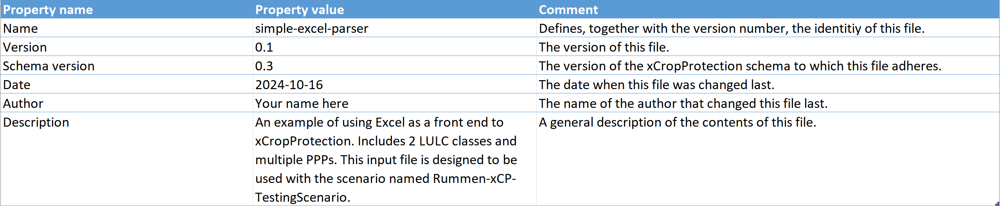
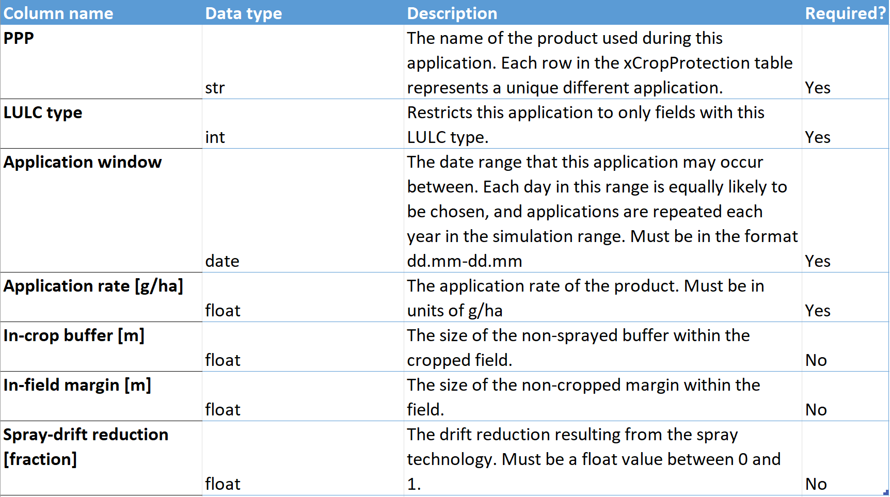
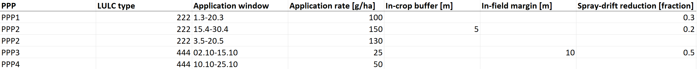

# Simple Excel Interface

As a first step to developing a full Graphical User Interface (GUI), we have developed an Excel interface that makes parameterizing simple xCropProtection scenarios easier. This Excel file is used as an alternative to the xCropProtection XML parameterization files (referred to as xCropProtection.xml on this page).

## General information

The Excel interface should be used when the scenario spans only one year or PPP applications occur during the same window each year. Multiple LULC types and PPPs can be defined, but no probability distribution functions are allowed for application rates (each rate must be a constant value). Each application can have independent in-crop buffers, in-field margins, and spray-drift reduction values. However, this interface does not support choice between multiple application sequences.

A PPM Calendar will be created for each unique LULC added to the Excel interface, with each PPM Calendar having one `Indication` and `ApplicationSequence` element.

## User guide

The Excel interface must be located in the *xCropProtection/CropProtection* folder, just like an XML parameterization file. In *xCropProtection/template.xrun*, be sure to change the file extension from .xml to .xlsx to denote that the input is an Excel file.

[UI-template.xlsx](../static/UI-template.xlsx){:download="xCropProtection-UI-template.xlsx"}

Using the above file as an example, the following section will describe how to parameterize the Excel file.

The first sheet in the UI template holds metadata about the file which is not used by xCropProtection, but helps others who may use the file.



The second sheet contains information about the columns in the third sheet including the data type, description, and if it is a required column. No changes need to be made to this sheet, as it exists for reference when parameterizing the input file.

{width="65%"}

The third sheet, xCropProtection, holds the parameterization information. Everything in this sheets gets translated to an xCropProtection.xml file, similar to what would be written by hand. A PPM Calendar is created for each LULC type, with all child elements included in the same file. This may look slightly different than hand-written xCropProtection XML files, which often use this "include" structure to make XML development easier:

```xml title="xCropProtection.xml"
<xCropProtection>
    <PPMCalendars>
        <PPMCalendar include="PPMCalendars/Rummen-xCP-TestingScenario/PPMCalendar-222.xml"/>
        <PPMCalendar include="PPMCalendars/Rummen-xCP-TestingScenario/PPMCalendar-444.xml"/>
    </PPMCalendars>
    <Technologies include="Technologies.xml"/>
</xCropProtection>
```

Every PPM Calendar created with this parser will have the following structure:

```xml
<PPMCalendar>
    <TemporalValidity scales="time/simulation">always</TemporalValidity>
    <TargetCrops type="list[int]" scales="global">222</TargetCrops>
    <Indications>
    <Indication type="xCropProtection.ChoiceDistribution" scales="time/year, space/base_geometry">
        <ApplicationSequence probability="1.0">
        <Application>
            ...
        </Application>
        <Application>
            ...
        </Application>
        ...
```

In other words, there will always be one `Indication` and one `ApplicationSequence` with multiple `Application` elements. Each row in this file will be translated to one of these `Application` XML elements. Each column in the sheet gives a different piece of information about that application.



As an example, the first two rows in the image above will translate to the following XML elements:

```xml
...
<Application>
    <Tank>
        <Products type="list[str]" scales="other/products">PPP1</Products>
        <ApplicationRates scales="other/products">
            <ApplicationRate type="float" unit="g/ha" scales="global">100</ApplicationRate>
        </ApplicationRates>
    </Tank>
    <ApplicationWindow type="xCropProtection.MonthDaySpan" scales="global">03-01 to 03-20</ApplicationWindow>
    <Technology scales="global">0.3-spray-drift-reduction</Technology>
    <InCropBuffer type="float" unit="m" scales="global">0</InCropBuffer>
    <InFieldMargin type="float" unit="m" scales="global">0</InFieldMargin>
</Application>
<Application>
    <Tank>
        <Products type="list[str]" scales="other/products">PPP2</Products>
        <ApplicationRates scales="other/products">
            <ApplicationRate type="float" unit="g/ha" scales="global">150</ApplicationRate>
        </ApplicationRates>
    </Tank>
    <ApplicationWindow type="xCropProtection.MonthDaySpan" scales="global">04-15 to 04-30</ApplicationWindow>
    <Technology scales="global">0.2-spray-drift-reduction</Technology>
    <InCropBuffer type="float" unit="m" scales="global">5</InCropBuffer>
    <InFieldMargin type="float" unit="m" scales="global">0</InFieldMargin>
</Application>
...
```

Each unique value in the "Spray-drift reduction [fraction]" column is assigned to a technology element with the naming convention fraction + "-spray-drift-reduction".

Currently, xCropProtection writes the intermediate XML translation file to the *xCropProtection/run/SIM_ID* folder. This file may be checked to be sure that parameterization is written as expected.