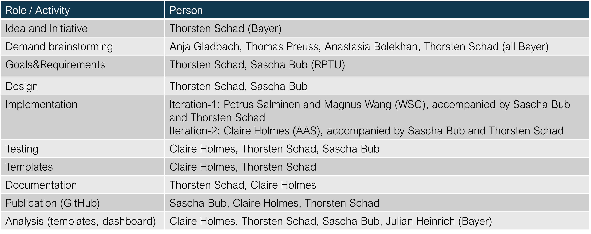

# Welcome to xOffFieldSoilRisk

Welcome to the xOffFieldSoilRisk (xSR) documentation. This documentation provides an **introduction** and will walk new users through **how to get started** with the xOffFieldSoilRisk landscape model, including explanations for **sample scenarios** and their use.

## Publication (Open Access)

An introduction to the topic is given in an open access publication in IEAM: [A spatiotemporally explicit modeling approach for more realistic exposure and risk assessment of off-field soil organisms](https://onlinelibrary.wiley.com/doi/10.1002/ieam.4798).  
The xOffFieldSoilRisk approach has been presented at different scientific conferences: xxx. (xxx include pdfs of the presentations.) 

## Background

The authorization process of plant protection products (PPPs) includes comprehensive regulatory risk assessment (RA) for nontarget species, including soil organisms. The European Food Safety Authority (EFSA) has released a scientific opinion on [“addressing the state of the science on RA of PPPs for in-soil organisms” (EFSA PPR Panel, 2017)](https://www.efsa.europa.eu/en/efsajournal/pub/4690), in which spray-drift depositions and runoff are identified as the most relevant potential exposure routes of off-field soil organisms, whereby the term “off-field” refers to areas outside the agricultural field boundaries, that is, essentially to (semi-) natural areas present in cultivated landscapes.  

  

Illustration of Off-Field-Soil definition  

The EFSA PPR Panel (2017) outlined a first approach to estimate off-field soil exposure. The conservative character of the approach and the necessity for model and scenario development are indicated in EFSA PPR Panel (2017): “In the absence of appropriate off-field exposure scenarios… Since such models are not yet available for regulatory purposes at the European level, the simplifying assumption is made that the individual exposure routes can be assessed separately. Results of the different entry routes should then be summed, which is a conservative assumption because it neglects the different dynamic behavior of the processes.”  

## Introduction

With the background above, the aims for the present work are to **develop a model approach to appropriately combine off-field soil exposure due to runoff and drift** and to develop example **scenarios** based on real-world conditions.  
xOffFieldSoilRisk is built on the basis of the [**xLandscape**](xLandscape/xLandscape-intro.md#xlandscape) **framework**. xLandscape provides a modular approach to develop landscape models which operate spatiotemporally explicit. xLandscape is open source.  
In its initial version, xOffFieldSoil has been composed using exposure models which are established in the regulatory scientific exposure assessment of pesticides in Europe (eg, [FOCUSsw](https://esdac.jrc.ec.europa.eu/projects/focus-dg-sante)). However, these models are not open sources and come with limitations for their spatiotemporally explicit operation with a large number of local conditions as typical at landscape-level. Thus, future versions of xOffFieldSoilRisk are intended to consider exposure modules adapted for landscape-level application.  

## Concepts

### Model Deliverables

Essentially, xOffFieldSoilRisk model outcome is intended to directly address [Specific Protection Goals](https://www.efsa.europa.eu/en/efsajournal/pub/1821).    

aggregation levels

## xOffFieldSoilRisk Model

 FIGURE 2 xOffFieldSoil model scheme. The model is composed of components (boxes in the central panel, e.g., xDrift; Bub et al., 2020). Components provide
 major model functionality (e.g., spray‐drift or runoff exposure calculation) and are built by wrapping existing models (e.g., PRZM) or by developing new ones
 (e.g., “RunoffFilter1”). The implementation of xOffFieldSoil is based on a generic modular landscape modeling framework (Schad, 2013). The light gray boxes
 represent xOffFieldSoil components that were not used in the case study, although they do exist or are under development (full scheme in Supporting
 Information: Figure S1, https://github.com/xlandscape/xOffFieldSoilRisk). Preparation and analysis panels contain tools, for example, for data preparation and risk analysis of model outcome (Supporting Information: Table S1) and operate closely with the framework, yet are not part of the core xOffFieldSoil model. PRZM, Pesticide Root Zone Model

### Framework Characteristics

xSR can be seen as a ready-to-use model, eg, to generate scenarios for the [BEEHAVE model](https://beehave-model.net/), for regions of pre-prepared geoinformation (see [Scenarios](#scenarios)).  
However, in order to enable its use for a range of purposes of modelling pollinator forage ([Background](#background)), for a range of foraging species and basically for any geographic region and scale, xSR was build to be open for any data inputs and sub-models. Eg, in case a bee forage modeller has data and models to simulate the occurrence of honeydew producers, this can be included in the xSR landscape model as a new component. So, besides its [modular](#modular-design) characteristic, you can also look at xSR from a **framework perspective**.

### Modular Design

Modelling the occurrence of bee forage in landscapes requires a **range of disciplines, information types and sub-models**. Nectar and pollen are produced by **flowering vegetation**, so vegetation type, plant species, their phenology and their specific nectar and pollen production (quantity, quality) is key data and information. Vegetation phenology depends on **environmental conditions**. Besides vegetation, bee forage does also occur as **honeydew**, which is produced by different insects (eg, Aphids probably the most well-known honeydew producers and often excrete large quantities, but also scale insects (Coccoidea), leafhoppers (Cicadellidae and others), Adelgids (Adelgidae), plant bugs (Heteroptera), whiteflies (Aleyrodidae), or mealybugs (Pseudococcidae)).  
Accordingly, for modelling pollinator forage at landscape scales, **fundamental building blocks (elements, modules)** were identified and implemented as separate components in xSR. An illustration is shown in the figure below.  

Distinct steps in bee forage modelling which define xSR components (building blocks/elements/modules).

Key modules are:

- **Land use/land cover** (LULC) information: an assembly of spatial data that represents essential LULC types that provide bee forage. The geodata layer is composed of any data that the modeller seems relevant and that can be acquired or generated at reasonable efforts, targeting the goals of the bee forage modelling work (study).
- **Vegetation and its phenology** (incl. honeydew producers): the module to translate LULC types to vegetation types and their phenology.
- **Bee forage modelling**: the module to generate beeforage(space, time, type).
- Parser: technical preparation of raw outcome as needed by the scenario clients (eg, the [BEEHAVE model](https://beehave-model.net/)).

A layered view to bee forage modelling adds to the illustration of the successive steps to deliver the ultimate bee forage information.  

Distinct data and information layers to derive bee forage (in space and time). (* *Sources* represent the occurrence of eg, honeydew producers)

This modularity enables to basically use any type of data, information and sub-models which are approriate to a specific bee (pollinator) forage modelling purpose. Example data inputs and parameterisations are introduced in the [Scenario](#scenarios) section.

### xOffFieldSoilRisk Landscape Model

The modular landscape model to for spatiotemporally explicit simulation of bee (pollinator) forage, xOffFieldSoilRisk (xSR), was built using the **landscape modelling framework** [xLandscape](xLandscape/xLandscape-intro.md#xlandscape). The framework allows to compose individual modules, called *Components* to a landscape models, that operates spatiotemporally explicit.  
The components represent and encapsulate distinct functionality. Any component can be replaced by more or less complex ones.  
Adding components adds functionality. For xSR, a version exists that comprises the use of pesticides (PPPs) and the environmental exposure (figure below). Again, each exposure route and process is represented by a specific component (which can be replaced to manage model complexity).  

  

Composition of the xOffFieldSoilRisk landscape model (v0.9). Its components are introduced in subsections below.

  

Composition of the xOffFieldSoilRisk landscape model (v0.9) including components to model PPP use and environmental exposure.

#### Runoff Component

#### Environmental Data

### Tiered Approach

xxx Depending on the purpose of bee (pollinator) forage modelling,  

1. off-the-shelf data: covering large geographic regions
1. best-available data, including manual processing
1. contemporary data generation: high-resolution drone mapping
1. field study: best possible landscape mapping, bee forage quantification and modelling

### xSR Simulation xxx: move to 'get started'

On each time step (eg, day) and field in a simulation, xSR checks if there are products to apply. If so, exact application details are determined based on model parameterisation (eg, deterministic or by sampling from  from distributions given by the user) and executed.  

## xOffFieldSoilRisk Landscape Model

## Scenarios

## Application

## Acknowledgements
The development of the xSR landscape model was initiated by Thorsten Schad (tschadwork@gmail.com). It's realisation was only possibly due to the contribution of colleagues listed below and the sponsoring by Bayer AG.  

 xxx

## References

EFSA Guidance  

(EFSA PPR Panel, 2017)](https://www.efsa.europa.eu/en/efsajournal/pub/4690)