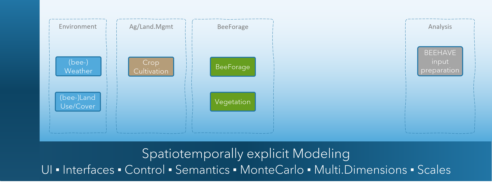

# Welcome to xBeeForage

Welcome to the xBeeForage (xBF) documentation. This documentation provides an **introduction** and will walk new users through **how to get started** with the xBeeForage landscape model, including explanations for **sample scenarios** and their use with the [BEEHAVE model](https://beehave-model.net/).

## Background

Today, scientific models make a great contribution to understanding and predicting the consequences of how we cultivate the landscapes we are living in. Based on present knowledge and together with data, models have become a key instrument in decision making.  
An important field is the risk assessment and management of pesticides. In Europe (and other countries), this includes an assessment of pollinator risk, in particular, for the honey bee [EFSA Bee Guidance](https://efsa.onlinelibrary.wiley.com/doi/10.2903/j.efsa.2021.6607). The risk assessment includes the use of models (eg,  [BEEHAVE model](https://beehave-model.net/), [ApisRAM](https://www.efsa.europa.eu/en/supporting/pub/en-9293) which require landscape scenarios for their operation. Key information of such scenarios is the occurrence of pollinator forage, i.e., the occurrence of nectar and pollen. This is where xBF comes in.  
xBeeForage is a landscape model to simulate bee forage occurrence (basically nectar and pollen) in cultivated landscapes in space and time. It's outcome can be directly used as input scenarios for bee (pollinator) models. It's modular and tiered design allows to basically use any land use/cover data together with forage information as input, depending on the model application purpose,  scales and certainty.  

Beyond this specific purpose, the conceptual basis, approaches as well as the landscape model xBF can be employed in a range of related research and applied topics, eg,  

- **landscape design and management, biodiversity enhancements**
- **Holistic view to risk**, multiple stressors analysis, systems-based approach, [EFSA, Bee Guidance](https://efsa.onlinelibrary.wiley.com/doi/10.2903/j.efsa.2021.6607))  
- Risk Assessment **Recovery Option** ([EFSA, Aquatic Guidance](https://www.efsa.europa.eu/en/efsajournal/pub/3290)) 
- **Environmental Impact Reduction** (EIR), eg, *what if* analysis, assessment and documentation of real-world EIR by new plantprotection products and digital environmental safety solutions  
- **Insect decline analysis**: habitat conditions    
- **Monitoring** (design, insights, transfer of results to other regions and times)  
- Solutions for **Integrated Pest Management**: improved integration of the use of chemicals and agricultural practices to reduce environmental impact, comparison of pest control options (eg, weed control)  
- **Specific Protection Goals**: identification of driving factors of populations dynamics for targeted chemical risk assessment endpoints and schemes  
- ***Ecosystem Services*** ([Millennium Ecosystem Assessment](https://www.millenniumassessment.org/en/index.aspx)): improvend quantitative insights into real-world *Ecosystem Services* for more explicit and transparent cost/benefit risk management. The work on the future of sustainable and regenerative agriculture **requires improved operational instruments** which allow to better understand real-world implications.  
  
## Intro

xBeeForage is a landscape model to simulate **pollinator forage occurrence** (basically nectar and pollen) in cultivated landscapes in space and time, i.e. xBF operates spatiotemporally explicit. Its conceptual basis is [**generic**](#concepts), whereas initial bee forage parameterisations and scenarios focus on the **honey bee**.  
xBF is based on the **modular landscape modelling framework** [xLandscape](xLandscape/xLandscape-intro.md#xlandscape).
  
Forage supply in the landscape largely determines honey bee activity and so the development of honey bee hives as well as of wild bee colonies. Correspondingly, the spatial and temporal occurrences of forage are essential information to model bee colony development (eg, using [BEEHAVE model](https://beehave-model.net/) or [ApisRAM](https://www.efsa.europa.eu/en/supporting/pub/en-9293)). This in turn, builds the basis for modelling exposure and effects of honey bees due to contact to pesticides.  
Bee forage is generally composed of nectar and pollen (as well as honeydew provided by insects mostly origin from trees). In cultivated landscapes, nectar and pollen are provided by a variety of crops, natural and semi-natural vegetation, with a correspondingly spatial and temporal variability of intensities and quality attributes (eg, sugar type, content, protein content, etc.).  
The entire process of modelling beeforage is of [modular design](#modular-design).  

## Concepts

### Framework Characteristics

xBF can be seen as a ready-to-use model, eg, to generate scenarios for the [BEEHAVE model](https://beehave-model.net/), for regions of pre-prepared geoinformation (see [Scenarios](#scenarios)).  
However, in order to enable its use for a range of purposes of modelling pollinator forage ([Background](#background)), for a range of foraging species and basically for any geographic region and scale, xBF was build to be open for any data inputs and sub-models. Eg, in case a bee forage modeller has data and models to simulate the occurrence of honeydew producers, this can be included in the xBF landscape model as a new component. So, besides its [modular](#modular-design) characteristic, you can also look at xBF from a **framework perspective**.

### Modular Design

Modelling the occurrence of bee forage in landscapes requires a **range of disciplines, information types and sub-models**. Nectar and pollen are produced by **flowering vegetation**, so vegetation type, plant species, their phenology and their specific nectar and pollen production (quantity, quality) is key data and information. Vegetation phenology depends on **environmental conditions**. Besides vegetation, bee forage does also occur as **honeydew**, which is produced by different insects (eg, Aphids probably the most well-known honeydew producers and often excrete large quantities, but also scale insects (Coccoidea), leafhoppers (Cicadellidae and others), Adelgids (Adelgidae), plant bugs (Heteroptera), whiteflies (Aleyrodidae), or mealybugs (Pseudococcidae)).  
Accordingly, for modelling pollinator forage at landscape scales, **fundamental building blocks (elements, modules)** were identified and implemented as separate components in xBF. An illustration is shown in the figure below.  

  

Distinct steps in bee forage modelling which define xBF components (building blocks/elements/modules).

Key modules are:

- **Land use/land cover** (LULC) information: an assembly of spatial data that represents essential LULC types that provide bee forage. The geodata layer is composed of any data that the modeller seems relevant and that can be acquired or generated at reasonable efforts, targeting the goals of the bee forage modelling work (study).
- **Vegetation and its phenology** (incl. honeydew producers): the module to translate LULC types to vegetation types and their phenology.
- **Bee forage modelling**: the module to generate beeforage(space, time, type).
- Parser: technical preparation of raw outcome as needed by the scenario clients (eg, the [BEEHAVE model](https://beehave-model.net/)).

A layered view to bee forage modelling adds to the illustration of the successive steps to deliver the ultimate bee forage information.  

  

Distinct data and information layers to derive bee forage (in space and time). (* *Sources* represent the occurrence of eg, honeydew producers)

This modularity enables to basically use any type of data, information and sub-models which are approriate to a specific bee (pollinator) forage modelling purpose. Example data inputs and parameterisations are introduced in the [Scenario](#scenarios) section.

#### xBeeForage Landscape Model

The modular landscape model to for spatiotemporally explicit simulation of bee (pollinator) forage, xBeeForage (xBF), was built using the **landscape modelling framework** [xLandscape](xLandscape/xLandscape-intro.md#xlandscape). The framework allows to compose individual modules, called *Components* to a landscape models, that operates spatiotemporally explicit.  
The components represent and encapsulate distinct functionality. Any component can be replaced by more or less complex ones.  
Adding components adds functionality. For xBF, a version exists that comprises the use of pesticides (PPPs) and the environmental exposure (figure below). Again, each exposure route and process is represented by a specific component (which can be replaced to manage model complexity).  

  

Composition of the xBeeForage landscape model (v0.9). Its components are introduced in subsections below.

  

Composition of the xBeeForage landscape model (v0.9) including components to model PPP use and environmental exposure.

#### BeeForage Component

The BeeForage component models the occurrence of nectar and pollen in space and time. The outcome is stored in a multidimensional data store.  
The current version (v0.9) uses spatial data on vegetation types (units) and their phenology as base input, together with information on nectar and pollen production by these vegetation types. The core functionality of the BeeForage component is to match (model) nectar and pollen production for each of these vegetation types. In the current version, this is done by a simple lookup tables (with a honey bee focus):  

1. Assigning nectar and pollen production intensity classes (0-4) to vegetation type (by time).  
1. Assigning nectar and pollen production quantities to intensity classes.  

  

Lookup table to assign nectar and pollen production intensity classes (0-4) to vegetation type (by time).

  

Lookup table to assign nectar and pollen production quantities to intensity classes.

Both lookup tables are based on literature and expert judgement (xxx).  

This initial realisation of the BeeForage-Component can be enhanced and replaced by more sophisticated bee forage modelling, eg, using data-driven/AI or mechanistic models, together with corresponding geoinformation on the underlying vegetation.  
The BeeForage-Component can also be extended to model the occurrence of honeydew, again, if corresponding models, knowledge and data are available (and fit to each other).  

#### Vegetation

In our representation of vegetation (and its phenology), instead of employing an of-the-shelf land use/cover (LULC) dataset, we compose bee forage-providing land use/land cover elements from different sources. This composition is driven by the study purpose and related requirements (eg, level of detail, precision, certainty, scales), data availability, and given ressources. Eg, 

- a LULC base layer (eg, topographic geodata) is used to identify general LULC types (eg, arable, forest, orchards, grasslands, gardens, ruderal) and more bee forage specific types if possible (eg, apple, decidious woods, arable crop types)  
- Specific bee forage providing crop types are identified from satellite imagery (eg, oil seed rape)  
- Likewise, grassland characterisation can be done using satellite imagery based approaches (eg, hayfield, natural, intense sillage)  
- Further bee forage relevant vegetation can be constructed from LULC base layers and literature (eg, riparian, wood margins)  
- High-resolution landscape elements can be added from mapping (eg, hedges, groups of bee forage relevant trees, etc.) 

The user defines PPP uses in a ***Crop Protection Calender***, including application technology, and mitigation measures for reducing exposure (risk). The approach of using a *Crop Protection Calender* is based on agricultural practice, where pest control measures for a crop are typically planned based on experiance, PPP availability and other factors. Crop protection plans are made eg, by official plant protection advisory services, farmers, or PPP producers. Besides reflecting ag practice, the approach of a CPC also addresses modelling practice in risk assessment which typically focus on a certain indication, conducted over long time periods. Beyond these established uses, alternative CPCs can be used to assess the environmental impact of alternative pest control options, or to design new pest control means against established ones, considered as baselines.  

#### LULC

Land use/cover data provides typically builds the spatial base information on 

Vegetation mapping and modelling. [European Vegetation Archive (EVA)](https://euroveg.org/eva-database/)

#### Environmental Data

### Tiered Approach

xxx Depending on the purpose of bee (pollinator) forage modelling,  

1. off-the-shelf data: covering large geographic regions
1. best-available data, including manual processing
1. contemporary data generation: high-resolution drone mapping
1. field study: best possible landscape mapping, bee forage quantification and modelling

### xBF Simulation xxx: move to 'get started'

On each time step (eg, day) and field in a simulation, xBF checks if there are products to apply. If so, exact application details are determined based on model parameterisation (eg, deterministic or by sampling from  from distributions given by the user) and executed.  

## xBeeForage Landscape Model

## Scenarios

## Application

## Acknowledgements
The need and the development of the xBF landscape model was initiated by Thorsten Schad (tschadwork@gmail.com). It's realisation was only possibly due to the contribution of colleagues listed below and the sponsoring by Bayer AG.  

 xxx

## References
EFSA Guidance  
BioDT

[EFSA Bee Guidance](https://efsa.onlinelibrary.wiley.com/doi/10.2903/j.efsa.2021.6607)  
Pritsch
Westrich Die Wildbienen Deutschlands
