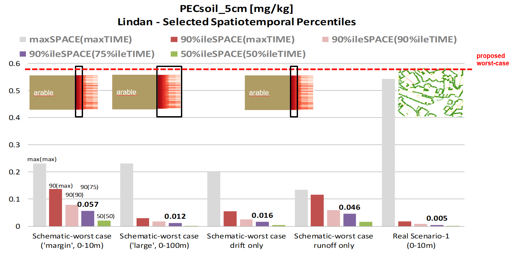

# Welcome to xOffFieldSoilRisk (xSR)

Welcome to the xOffFieldSoilRisk (xSR) documentation. This documentation provides an **introduction** and will walk new users through **how to get started** with the xOffFieldSoilRisk landscape model, including explanations for **sample scenarios** and their use.  

## Publication

An introduction to the topic is given in an **open access** publication in IEAM: [A spatiotemporally explicit modeling approach for more realistic exposure and risk assessment of off-field soil organisms](https://onlinelibrary.wiley.com/doi/10.1002/ieam.4798). The xOffFieldSoilRisk approach has been presented at different scientific conferences, eg:  

- [Presentation at SETAC Europe 2025](pdf/SETAC-EU2025_3.03.C.T-04_xOffFieldSoil.pdf)
- [Poster on 'Landscape level simulation of off-field exposure by run-off'](pdf/poster_khammel_et_al_3_10P_11_24042020.pdf)
- [Poster on 'Runoff/erosion deposition'](pdf/SETAC2017_Poster_KHammel-DescribingOffCropDepositionOfPesticidesViaRunoffErosionFromTreatedFields.pdf)

The xOffFieldSoilRisk model and examplary scenarios are published on Github (section [Get Started](getstarted/getstarted.md#introduction))  

## Background

The authorization process of plant protection products (PPPs) includes comprehensive regulatory risk assessment (RA) for nontarget species, including soil organisms. The European Food Safety Authority (EFSA) has released a scientific opinion on [“addressing the state of the science on RA of PPPs for in-soil organisms” (EFSA PPR Panel, 2017)](https://www.efsa.europa.eu/en/efsajournal/pub/4690), in which spray-drift depositions and runoff are identified as the most relevant potential exposure routes of off-field soil organisms, whereby the term “off-field” refers to areas outside the agricultural field boundaries, that is, essentially to (semi-) natural areas present in cultivated landscapes.  

  

Illustration of Off-Field-Soil definition  

The EFSA PPR Panel (2017) outlined a first approach to estimate off-field soil exposure. The conservative character of the approach and the necessity for model and scenario development are indicated in EFSA PPR Panel (2017): “In the absence of appropriate off-field exposure scenarios… Since such models are not yet available for regulatory purposes at the European level, the simplifying assumption is made that the individual exposure routes can be assessed separately. Results of the different entry routes should then be summed, which is a conservative assumption because it neglects the different dynamic behavior of the processes.”  

## Introduction

With the background above, the aims for the present work are to **develop a model approach to appropriately combine off-field soil exposure due to runoff and drift** and to develop example **scenarios** based on real-world conditions.  
xOffFieldSoilRisk is built on the basis of the [**xLandscape**](xLandscape/xLandscape-intro.md#xlandscape) **framework**. xLandscape provides a modular approach to develop landscape models which operate spatiotemporally explicit. xLandscape is open source.  
In its **initial version**, xOffFieldSoil has been composed using **exposure models which are established in the regulatory scientific exposure assessment** of pesticides in Europe (eg, [FOCUSsw](https://esdac.jrc.ec.europa.eu/projects/focus-dg-sante)). However, these models are not open source and come with limitations for their spatiotemporally explicit operation with a large number of local conditions as typical at landscape-level. Future versions of xOffFieldSoilRisk are intended to consider exposure modules more adapted for integrating in landscape-level applications.  

### xSR Outcome for Risk Assessments

Basically, xOffFieldSoilRisk model outcome aims to be to be **directly used in off-field-soil RAs**. To this end, **exposure endpoints** need to be developed that fit into current RA schemes, in particular to lower-tier TER (Toxicity Exposure Ratio) and RQ (Risk Quotion) based approaches. Thus, **raw spatiotemporally explicit model outcome needs to be aggregated into ready-to-use exposure values**. To keep this process **transparent**, we propose a **stepwise approach**, including visualisations, to enable an understanding of the level of conservatism of aggregated exposure values. Therefore, at the present initial phase, this process is implemented as **Jupyter Notebooks** and **R**. The analysis steps can be executed manually (and adapted) using the Jupyter Notebooks, or can be conducted automatically at the end of an xSR model run (as xSR component).  

A second option to use xSR model output is to **link xSR directly with effect models** (eg, TKTD, Folsomia, Eisenia, [Earthworms](https://doi.org/10.1002/ieam.4338)). These effect models will be implemented as components (moduls) and **integrated into xSR** and will deliver RA endpoints at the level of defined SPGs ([Specific Protection Goals](https://www.efsa.europa.eu/en/efsajournal/pub/1821), [EFSA PPR Panel 2017)](https://www.efsa.europa.eu/en/efsajournal/pub/4690)), eg, on species population level.  Although at scientific and technical level the necessary bits and pieces are ready, the establishment of landscape-level SPG endpoints in regulatory RA and risk management studies needs further development.  

### xSR Use for Regulatory Research & Development

More realistic RA and risk management, more holistic evaluation of pesticide risk, integrated pest assessment, integrated cost/benefit ecosystem service assessments, are currently intensely discussed topics with a need for tools and data. Among the already and more precisely defined topics for development is to build consistent lower tier approaches from reasonably realistic 'Reference Scenario' levels. The latter directly calls for landscape-level exposure and effect modelling on the basis of resonably realistic scenarios.  
The conceptual developments and modular implementation of xSR might contribute to these developments in the regulatory scientific community.  

  

Illustration of the potential of xOffFieldSoilRisk to support the development of lower-tier approaches from landscape-level analysis: for the persistent substance Lindane, analysed assessment endpoints (percentiles of PECsoil of time and space) are significantly below a worst-case approach (based on FOCUSsw-Step2) and below the maximum single values in space and time observed in edge-of-field and landscape scenarios. The single extreme value observed at one point in time and one off-field soil 1m2 shows that the xSR approach can also reproduce very unfavorouble conditions in real-world landscapes.  

## Implementation

### xLandscape Framework

xSR was built using the **modular landscape modelling framework** [xLandscape](xLandscape/xLandscape-intro.md#xlandscape). The framework allows to compose individual modules, called *Components* to landscape models which operate spatiotemporally explicit. The components represent and encapsulate distinct functionality. Any component can be replaced by more or less complex ones.  

### xOffFieldSoilRisk Landscape Model

The initial implementation of xSR was guided by [EFSA (2017)](https://www.efsa.europa.eu/en/efsajournal/pub/4690) and established approaches (models) in regulatory RA.  
The figure below shows the components (modules) from which xSR is built. Each exposure route and process is represented by a specific component, which can be replaced to adapt xSR model complexity.  
Please find details in the open access publication ["A spatiotemporally explicit modeling approach for more realistic exposure and risk assessment of off-field soil organisms"](https://onlinelibrary.wiley.com/doi/10.1002/ieam.4798).  

  

 xOffFieldSoil model scheme. The model is composed of components (boxes in the central panel, e.g., [xDrift](https://www.sciencedirect.com/science/article/pii/S235271102030323X)). Components provide major model functionality (e.g., spray‐drift or runoff exposure calculation) and are built by wrapping existing models (e.g., PRZM, Pesticide Root Zone Model) or by developing new ones (e.g., “RunoffFilter1”). The implementation of xOffFieldSoil is based on the generic modular [xLandscape](xLandscape/xLandscape-intro.md#xlandscape) modeling framework. The light gray boxes represent xOffFieldSoil components that were not used in the case study, although they do exist or are under development. Preparation and analysis panels contain tools, for example, for data preparation and risk analysis of model outcome and operate closely with the framework, yet are not part of the core xOffFieldSoil model.  

### Scenarios

xSR can be used in any region for which the minimum required geodata can be acquired (or generated) and prepared.  
xSR is shipped with ready-to-use [example scenarios](scenarios/scenarios-examples.md) which can also serve as templates for own scenario development.  
An introduction and details to scenario development is given in the [Scenarios](scenarios/intro-scenarios.md#introduction) section.  

## Outlook

The following topics are among the ongoing or discussed **future developments**:  

- Tutorial and training
- Enhanced and simplified runoff components (modules)
- Scenario building tools
- UI, webrowser-based parameterisation and model use
- Extended analysis and visualisation functionality
- Standardisation of model outpts and reporting (as discussed in the regulatory scientific community)

Beyond model and scenario development, and besides further **case studies** which are required to extend **insights** into risk drivers of off-field soil organismsm, the **exchange in the regulatory-scientific community** of pesticide RA is key to **sustainably create value** from this initiative.  

## Acknowledgements

The development of the xSR landscape model was initiated by Thorsten Schad ([tschadwork@gmail.com](mailto:tschadwork@gmail.com)). It's realisation was only possibly due to the contribution of colleagues listed below and the sponsoring by Bayer AG.  

| Role / Activity   | Person      |
|-------|----------|
| Idea and Initiative | Thorsten Schad  |
| Demand Evaluation   | Gregor Ernst (Bayer), Thomas Preuss (Bayer), Thorsten Schad  |  
| Goals and Requirements   | Thorsten Schad, Sascha Bub (RPTU)  |  
| Design   | Thorsten Schad, Sascha Bub  |  
| Implementation   | xOffFieldSoilRisk landscape model: Sascha Bub, Thorsten Schad. Runoff-Component: Joachim Kleinmann, Magnus Wang, Sascha Bub, Thorsten Schad. Analysis: Sascha Bub, Claire Holmes (AAS), Thorsten Schad  |  
| Testing   | Thorsten Schad, Theo Schad (Bayer Intern), Sascha Bub, Chris Holmes (AAS)  |  
| Scenarios   | Thorsten Schad, Sascha Bub  |  
| Publication   | Github: Sascha Bub, Thorsten Schad. [IEAM (4798)](https://onlinelibrary.wiley.com/doi/10.1002/ieam.4798): see 'Author Contribution'. Conferences: see section [Publication](index.md#publication-open-access) above |  

## References

Bub, S., Schad, T., Gao, Z. 2020. [XDrift—An R package to simulate spatially explicit pesticide spray-drift exposure of non-target-species habitats at landscape scales.](https://www.sciencedirect.com/science/article/pii/S235271102030323X)  
  
EFSA PPR Panel. 2017. [Scientific Opinion addressing the state of the science on risk assessment of plant protection products for in‐soil organisms.](https://www.efsa.europa.eu/en/efsajournal/pub/4690) EFSA Journal. Wiley Online Library.  

Valery E Forbes, Annika Agatz, Roman Ashauer, Kevin R Butt, Yvan Capowiez, Sabine Duquesne, Gregor Ernst, Andreas Focks, Andre Gergs, Mark E Hodson, Martin Holmstrup, Alice SA Johnston, Mattia Meli, Dirk Nickisch, Silvia Pieper, Kim J Rakel, Melissa Reed, Joerg Roembke, Ralf B Schäfer, Pernille Thorbek, David J Spurgeon, Erik Van den Berg, Cornelis AM Van Gestel, Mathilde I Zorn, Vanessa Roeben, [Mechanistic Effect Modeling of Earthworms in the Context of Pesticide Risk Assessment: Synthesis of the FORESEE Workshop,](https://doi.org/10.1002/ieam.4338) Integrated Environmental Assessment and Management, Volume 17, Issue 2, 1 March 2021, Pages 352–363.  

## next Section: [Get Started][def]

[def]: getstarted/getstarted.md#intro
