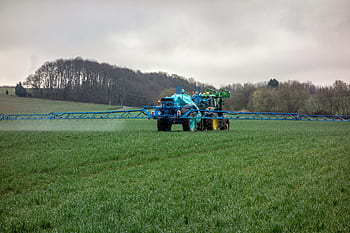

# Glossary

Basically, all xCP entities are defined close to the real-world objects they represent (overview graphic on xCP Entities in [Indication](#indication)).  
 

## Active Substance

An active substance (a.s.) in a plant protection product is any chemical, plant extract, pheromone, or micro-organism (including viruses) that acts against pests or affects plants, parts of plants, or plant products (https://food.ec.europa.eu/plants/pesticides_en). Essentially, it's the component that provides the intended protective or pesticidal effect.  
*Active Substances* have physical and chemical properties as well as ecotoxicological endpoints. These data are kept in corresponding databases. 

## Application

When a PPP is/PPPs are applied to a certain crop at a certain field we call this an *Application*. Typically, a farmer puts a PPP (or a set of PPPs) into a spraying tank, fills the tank up with water, drives to the field and sprays the solution onto the field (into the crop). In xCP context, the term *Application* is used close to agricultural practice, yet, is related to its use in pesticide risk assessment, especially the exposure modelling part.  
 An *Application* is defined by  
 - the PPP (or PPPs) to be applied  
 - an *Application Rate* (eg, in [µg a.s./ha] or [mL PPP/ha])  
 - a time when the application is intended (eg, deterministic day or a time window with a related distribution function)  
 - the technology with which the application will be done (eg, boom sprayer)  
 - risk mitigation measures (eg, spray buffer, in-crop buffer, drift-reducing nozzles)  
 

  
*PPP spray application using a boom sprayer*  

Remark: Influenced by classic exposure modelling, at the current development status, the definition of an *Application* includes the definition of an application timing, although in agricultural practice typically the use of a PPP is related to crop development stages. Thus, currently, the modeller has to determine the dependence of regional crop development with time. Future xCP versions are planned to allow defining an *Application* related to crop development stage (which can be provided by databases or crop development modelling).   

## Application Rate

In agricultural practice, the amount of PPPs applied to a field is usually determined as amount PPP by field area. 
The farmer typically determines the volume PPP [mL] by field area [ha] (eg, considering the crop development status, *'the higher the crop the more PPP needed'*).   
As risk assessment often focuses on active substance (a.s.), so does modelling. Therefore, in xCP the *Application Rate* can be defined as amount a.s. or PPP per field ares (eg, [µg a.s./ha], [mL PPP/ha]).

## Application Sequence

A sequence of individual PPP *Applications*. Each individual *Application* within an *Application Sequence* can be defined independently. Thus, an *Application Sequence* can represent, eg, the multiple use of the same PPP (PPPs) using the same technology and risk mitigation, yet, at individual application rates (eg, as often the case for fungicide uses in orchards). However, an *Application Sequence* can also represent uses of different PPPs in a sequence (as illustrated in the graphic below).   

*Illustration of a PPP application sequence using different PPPs*  
(https://rwz.ag/fileadmin2023/Agrarhandel/Weinbau/Mosel/240124_bild_weinbauempfehlung-pflanzenschutz-mosel.png)

## Application Window

 The time when an application is planned to be conducted. In a modelling experiment using xCP, an *Application Window* can be a deterministic day or a time span (eg, 1.-14. April). In the latter case, a probability distribution function is assigned to an application window from which actual application dates are sampled during model runtime. 

Remark: Influenced by classic exposure modelling, at the current development status, the definition of an *Application* includes the definition of an application timing (*Application Window*), although in agricultural practice typically the use of a PPP is related to crop development stages. Thus, currently, the modeller has to determine the dependence of regional crop development with time. Future xCP versions are planned to allow defining an *Application* related to crop development stage (which can bw provided by databases or crop development modelling).  
Also, typically farmers' decisions depend on agricultural and environmental conditions. xCP is planned to allow the definition of such dependency rules, eg, not to conduct a certain spray application when a rainstorm is predicted by weather forecast.  

## Buffer

A distance ([m]) that is kept (has to be kept) to a certain entity during an agricultural activity. Buffers are typically used to implement risk mitigation means, eg, to reduce spray-drift depositions into habitats of non-target-organisms. To protect aquatic organisms no-spray buffers are defined as distance to water bodies (eg, a PPP is allowed to be spray no closer than 10 m distance to streams). To protect terrestric organisms, often in-field or in-crop buffers are defined (eg, spraying has to keep a 5 m distance from the cropped/field boundery).

## Configuration
As for each [xLandscape](../xLandscape/xLandscape-intro.md#xlandscape) component and landscape model, user simulation inputs and control settings are separated in two different levels, a *Configuration* and a [*Parameterisation*](#parameterisation) level:  
- the **configuration** of a component (like xCP) allows to change fundamental model behaviour (eg, minimum sprayed area, in-crop buffer calculation).
- the [*Parameterisation*](#parameterisation) level of a component represent the actual user interface, ie, the model parameters exposed to the user. Inputs made by the user in the parameterisation file define a landscape modelling [Experiment](#experiment).  

The decision on which model component parameters should be exposed as user interface in the [*Parameterisation*](#parameterisation) level depends on the purpose of the model and the user group. The assignment of model component parameters to either the configuration or the [Parameterisation](#parameterisation) level can be changed with minimum effort ([xLandscape-Parameters](../xLandscape/xLandscape-parameterisation.md#assign-parameters-to-parameter-level)).  

Both, *configuration* and [*Parameterisation*](#parameterisation) refer to direct user inputs (user interaction) and are separated from more extense data inputs like land use data, weather data or pesticide phys-chem properties. Typically, in the user inputs links to such databases to be used in a landscape modelling [Experiment](#experiment) are defined wheras the actual data are taken from these databases.  

## Crop Protection Calender
The *Crop Protection Calender* (CPC) is a key parameterisation element of xCP. It is the entry point of each xCP PPP use scenario.  
In agricultural practice, pest control measures for a crop are typically planned based on experiance, PPP availability and other factors. Such planning can happen quite early in a season or closer to actual pest control. Crop protection plans are made eg, by official plant protection advisory services, farmers, or PPP producers. The term *Calender* is used to emphasise its temporal (crop development stage) aspects and similarity to everyday calenders we are used to.  adaptation).  
Besides reflecting ag practice, the approach of using a CPC also addresses modelling practice in risk assessment which typically focus on a certain indication, conducted over long time periods. 
Beyond these established uses, alternative CPCs can be used to assess the environmental impact of alternative pest control options, or to design new pest control means against established ones, considered as baselines.  

Summary on CPC characteristics: a CPC
- is specific to a crop (or group of crops)
- has a temporal validity, ie it can be constant over the entire model simulation period or can change at any (defined) time step
- can be adaptive, ie can change during model runtime (eg, reacting on pest pressure)  

 

  
*Visualisation of plant protection recommendations in apple for the forthcomming season (colors represent insecticides, fungicides, growth regulators and herbicides)*

")  
*Example plant protection recommendations in vines (Bayer AG)*

## Experiment
The term *Experiment* has been introduced to [xLandscape](../xLandscape/xLandscape-intro.md#xlandscape) model simulations as an analogue to experimental setups.  
An *Experiment* has a single model parameterisation (including xCP parameterisation) and consists of a number of *Monte Carlo* runs. The latter are independent from each other, ie. in each *Monte Carlo Run* the defined variabilities (Probability Density Functions, PDFs) are independently sampled.  
As compared to experimental setups, the 'control' setup is basically assumed to be the no-PPP use, ie non-exposure situation. However, alternative baseline scenarios can be defined as separate *Experiments* (eg, representing alternative/'organic'/'biological' pest control measures) and their outcome considered in the (comparative) analysis.  

## In-/Off-field, In-/Off-crop
In regulatory risk assessment in Europe, protection goals and risk assessment approaches are different for in-field and off-field areas. Basically, the **in-field area** is given by the property of the farmer and its bounderies (as you might find on cadastral maps). In cultivated landscapes, **off-field areas** are typically represented by parts of the field margin (eg, between roads and fields), riparian zones, wood margins. When you see vegetation strips between two arable fields, these are caused due to the working space of the agricultural machinery but  do not represent off-field areas as the two arable properties directly border to each other.  
**In-crop** simply represents the currently cropped area. Likewise, **off-crop** represents all (currently) non-cropped area.  
**In-field off-crop** areas are such within the field (property) of a farmer, yet, are currently not cropped. Such areas occur as (in-field) field margins, in some cases just left as a fallow strip, in others of sown flowering strip (to support wildlife and forage for insects). Such in-field margins are also intended to reduce potential run-off of pesticide residues from the field into off-field areas and streams.  

  

*Illustration of In-/Off-Field vs. In-/Off-Crop definition. The scheme on the left shows the definition as occurring in official documents. The image on the right shows a typical field situation (Hessian, Germany)*  
 
  
*Illustration of In-/Off-Field vs. In-/Off-Crop using a schematic scenario. The in-field (left part) is cropped (brown color), yet, has an in-field off-crop margin (light green). The off-field area (right part) is divided into two zones, representing two different land cover types in the expample (wood margin, wood core)*

## In-crop Buffer
As a *Risk Mitigation* option, typically to reduce spray-drift depositions into off-field areas, in-crop buffer represent a zone (distance [m]) from the cropped area boundery which must not be sprayed with the PPP of such a label instruction.  
 
  
*Illustration of In-/Off-Field vs. In-/Off-Crop using a schematic scenario. The in-field (left part) is cropped (brown color), yet, has an in-field off-crop margin (light green) as well as an in-crop buffer (solid box). The cropped area within the in-crop buffer is allowed to be sprayed (solid box), whereas the cropped area outside is not. The off-field area (right part) is divided into two zones, representing two different land cover types in the expample (wood margin, wood core)*

## Indication
Generally, measures to protect plants (crop) from a certain pest.  
In xCP, an *Indication* is an explicit part of its parameterisation. An *Indication* is made of *PPP Application Sequences*, at minimum one *PPP Application Sequence*. If more than one *Application Sequence* is defined in an *Indication*, these sequences are considered **alternative** *Application sequences* ('OR' related). Thus, the xCP parameterisation entity *Indication* can be used to define alternative PPP use pattern, eg, reflecting product market shares or fractions 'biological' or 'organic' pest control means.  
Multiple *Indications* can be defined in an xCP parameterisation, as many as necessary to represent a simple or complex real-world PPP use pattern in one or many crops. Each individual *Indication* defined will be conducted in an xCP simulation. 

  
*xCP entities and their relationship*

## Monte Carlo Run
Monte Carlo simulations rely on random sampling drawn from probability distributions to obtain numerical results. They can be used to model phenomena with significant variability (and uncertainty) in inputs, such as calculating the possible exposure profile of pesticides in streams in a catchment and the variability of possible effects to aquatic organisms. A nested (2D) Monte Carlo approach allows to also assess consequences of uncertainties to model outcome.  

The [xLandscape](../xLandscape/xLandscape-intro.md#xlandscape) model is a numeric approach that works spatially and temporally explicit. Some phenomenons can be considered deterministic, eg, land use at a certain location and time (as derived from satellite data) or when using historic weather data. However, real-world phenomenons are sometimes not exactly known in space and time, eg, farming activities, catchment conditions or local wind conditions. In such cases, variability distributions can be derived (from data and/or expert judgement), modelled using Monte Carlo, in order to assess the range of possible consequences for the environment and for species. This is done in an xLandscape model by defining an [*Experiment*](#experiment) which consists of a number of Monte Carlo runs to sample the range of possible conditions of the defined real-world landscape system.  

## Parameterisation
As for each [xLandscape](../xLandscape/xLandscape-intro.md#xlandscape) component and landscape model, user simulation inputs and control settings are separated in two different levels, a *Configuration* and a [*Parameterisation*](#parameterisation) level:  
- the [*Configuration*](#configuration) of a component (like xCP) allows to change fundamental model behaviour (eg, minimum sprayed area, in-crop buffer calculation).
- the **parameterisation** level of a component represent the actual user interface, ie, the model parameters exposed to the user. Inputs made by the user in the parameterisation file define a landscape modelling [Experiment](#experiment).  

The decision on which model component parameters should be exposed as user interface in the *parameterisation* level depends on the purpose of the model and the user group. The assignment of model component parameters to either the [*Configuration*](#configuration) or the *parameterisation* level can be changed with minimum effort ([xLandscape-Parameters](../xLandscape/xLandscape-parameterisation.md#assign-parameters-to-parameter-level)).  

Both, [*Configuration*](#configuration) and *parameterisation* refer to direct user inputs (user interaction) and are separated from more extense data inputs like land use data, weather data or pesticide phys-chem properties. Typically, in the user inputs links to such databases to be used in a landscape modelling [Experiment](#experiment) are defined wheras the actual data are taken from these databases.

## Plant Protection Measure (PPM)
An action to prevent or control pests, eg, protecting apples against powdery mildew fungy or protecting olives against the white fly.  
In xCP, a *Plant Protection Measure* is represented by one or more *Indications*.  

## Plant Protection Product (PPP)
Plant protection products (PPPs) are chemical or biological products which are used to protect plants or plant products from harm caused by animals (eg, insects and rodents) or diseases such as fungal infestation. Products which are used to eliminate unwanted field weeds are also considered PPPs. The term “pesticides” is often used instead of plant protection product.  
PPPs contain one or more *Active Substances* and other co-formulants (substances which are supposed to have a positive effect on the production, storage or use of a product). The product itself is used in various forms, for example as spraying agents for seed treatment or in granular form.  

## Risk Mitigation / Risk Mitigation Measures
Regarding the use of PPPs and from an operational point of view, here *Risk Mitigation* basically refers to reducing exposure caused by PPP application. For more information have a look into the outcome of the [MAgPie Workshop](https://www.openagrar.de/receive/openagrar_mods_00027102 "Mitigating risks of Plant Protection Products in the environment").
  
In xCP, currently the following *Risk Mitigation* measures are implemented:
- no-spray buffer (typically defined in relation to water bodies)
- in-crop buffer (a distance a farmer has to keep from the cropped boundery when spraying)
- use of drift-reducing nozzles (sprayer technology to reduce drift)

## Scenario
In the context of risk assessment for pesticides, a *Scenario* refers to a set of conditions and assumptions used to model and predict the environmental fate and effects of pesticides. At lower tiers of the risk assessment procedure, *Scenarios* are designed to represent realistic worst-case situations to ensure that the risk assessments are protective of human health and the environment. When getting more realistic, at higher-tier risk assessment levels, *Scenarios* are intended to represent real-world conditions.  
Some key elements that define a scenario in this context:

1. **Abiotic Factors**: These include non-living environmental factors such as soil type, climate/weather, landscape topology, and water bodies. For example, a scenario might consider how a pesticide behaves in sandy soil under high rainfall conditions. 
2. **Biotic Factors**: These involve living organisms that might be affected by the pesticide, including plants, animals, and microorganisms. The scenario might assess the impact on a specific species or a group of species. 
3. **Agronomic Practices**: This includes farming practices such as land use, crop rotation, land management, irrigation, and pesticide application methods. Different practices can influence how pesticides are distributed and degraded in the environment. 
4. **Exposure Pathways**: Scenarios consider how habitats and species might be exposed to pesticides, such as through forage, water, or contact. 
5. **Temporal Aspects**: The timing of pesticide application, its persistence in the environment and temporal relationship to the occurrence of species are crucial. Scenarios might model short-term (acute) and long-term (chronic) exposures.  

By combining these factors, scenarios build a crucial basis to create a comprehensive picture of the potential risks associated with pesticide use.

In xCP, the term *PPP use scenario* is sometimes used to address a certain *Parameterisation* of xCP (as part of a landscape model). 
Likewise, modellers often talk about a *landscape scenario* meaning the certain geographic region for which eg, land use/cover, soil, weather and habitat conditions have been defined as basis for landscape-scale pesticide exposure and effect modelling. 

## Simulation
The term *Simulation* is not precisely defined and is used somehow colloquial with different meanings. This is not a problem as the actual meaning typically gets clear in its use context:  
- a model simulation can just mean to parameterise and run a model in general
- an xLandscape model simulation can mean to conduct an *Experiment*, ie, here the terms are used synonymously
- a *Simulation* can also address an individual *Monte Carlo* run of an xLandscape model [*Experiment*](#experiment). 

