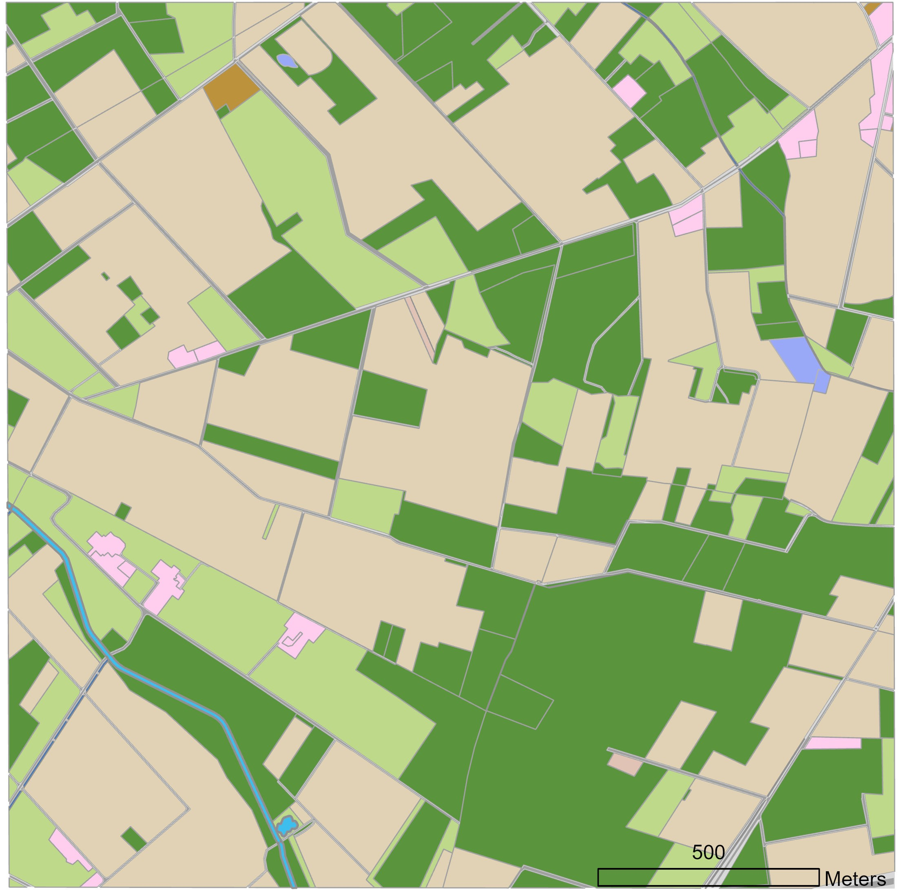
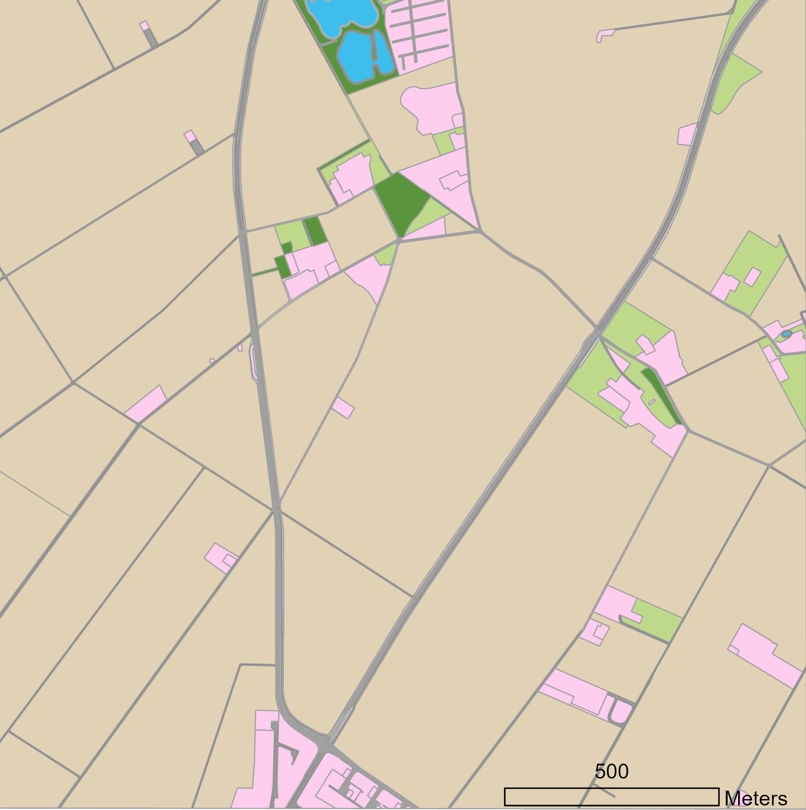
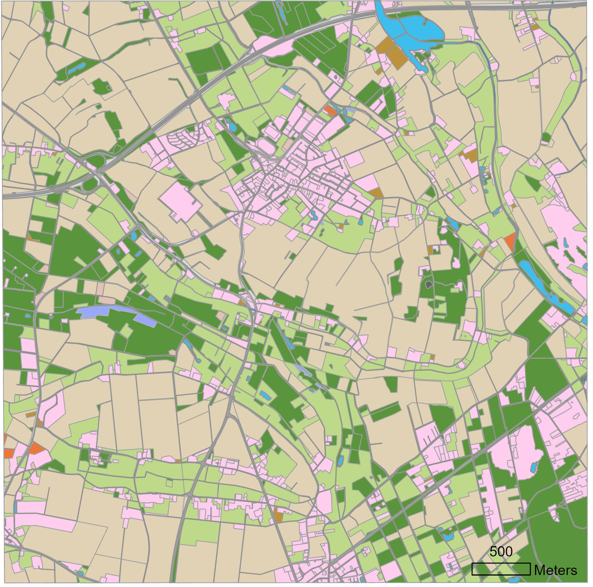

# Scenarios (under preparation)

## Introduction

The local **co-occurrence of arable fields and off-field areas** (eg, field margins, hedges, riparian zones, wood margins, graslands), their slopes, structure and management, together with environmental conditions, are key drivers of potential pesticide exposure and risk of off-field-soil organisms. A technical representation of certain geographic area (or artificial composition) covering these driving factors is what we call a ***scenario***.  
In **regulatory RA**, scenarios are selected and designed to represent a certain **protection level** for the entirety of situations in a given regulatory unit (eg, a country). **Conservative** scenario conditions for the risk of non-target-organismsm are protective for a large fraction of populations (typically >90%) and are basically used at lower-tier RA levels. Using a **variety of more realistic landscape-level scenarios** allows to obtain insights on risk drivers and to define adpated risk mitigation and management measures.  

## Example Scenarios

### Publication (Open Access)

Example scenarios introduced in the publication to the xSR model in IEAM: [A spatiotemporally explicit modeling approach for more realistic exposure and risk assessment of off-field soil organisms](https://onlinelibrary.wiley.com/doi/10.1002/ieam.4798) or also open access and available at Github:  

- xxx
- xxx [NRW1](https://github.com/xlandscape/Scenario-NRW1)

### Schematic Scenarios

  

### Landscape Scenarios

#### NRW1

  

#### NRW2

  

#### NRW3

  

## Scenario Development

LULC, off-field soil definition
we propose to understand xSR scenarios as a composition of off-field soil habitats, typically combining ready-to-use LULC data with knowledge 