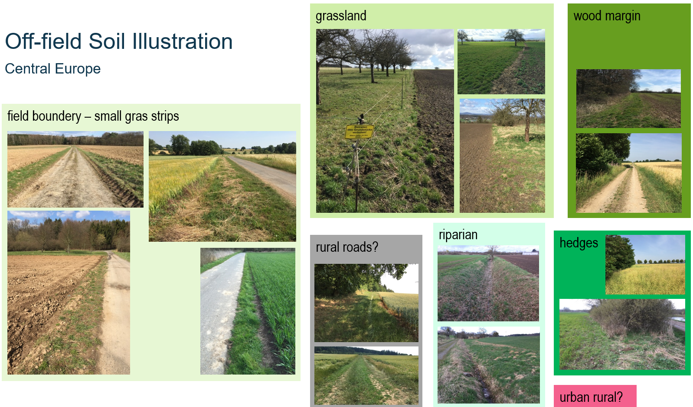
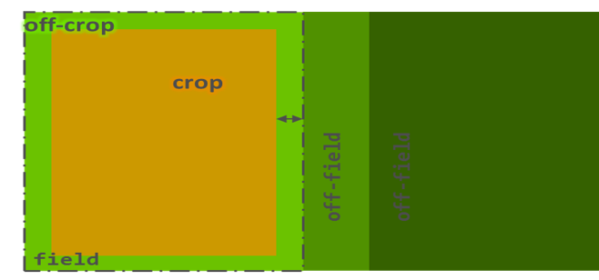
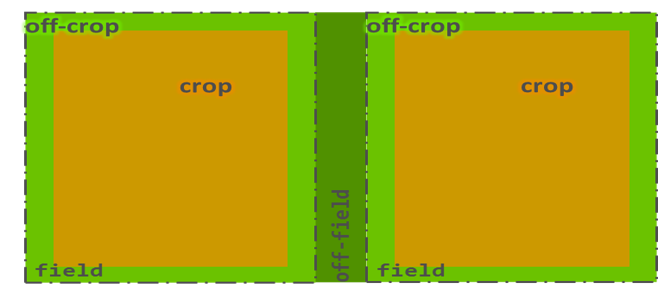
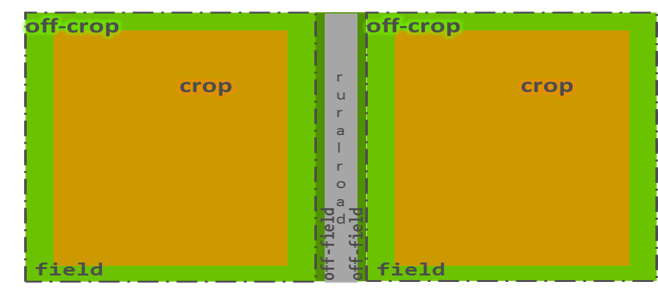

# Scenarios (under preparation)

## Introduction

The local **co-occurrence of arable fields and off-field areas** (eg, field margins, hedges, riparian zones, wood margins, graslands), their slopes, structure and management, together with environmental conditions, are key drivers of potential pesticide exposure and risk of off-field-soil organisms. A technical representation of certain geographic area (or artificial composition) covering these driving factors is what we call a ***scenario***.  
In **regulatory RA**, scenarios are selected and designed to represent a certain **protection level** for the entirety of situations in a given regulatory unit (eg, a country). **Conservative** scenario conditions for the risk of non-target-organismsm are protective for a large fraction of populations (typically >90%) and are basically used at lower-tier RA levels. Using a **realistic landscape-level scenarios** allows to obtain insights on real-world risk drivers and to define adpated risk mitigation and management measures. This is further improved when using a **variety of more realistic landscape-level scenarios**.  

## Off-Field Soil Areas

Formally, off-field areas starts at the property boundery of the field (see scheme in [Background](/docs/index.md#background)).  
However, the idea of protection goals is xxx . Thus, in real-world . Often arable fields directly border to each other. So there is 

scenarios are **constructed** 

Illustration of potential off-field soil areas in cultural landscapes in central Europe.  

| Land use/cover | Notes |
| --------------| --------|
| Field margin | xxx |

## Example Scenarios

### Publication (Open Access)

Example scenarios introduced in the publication to the xSR model in IEAM: [A spatiotemporally explicit modeling approach for more realistic exposure and risk assessment of off-field soil organisms](https://onlinelibrary.wiley.com/doi/10.1002/ieam.4798) are also open access and available at Github:  

- xxx
- xxx [NRW1](https://github.com/xlandscape/Scenario-NRW1)

### Schematic Scenarios

different purposes  

- represent a single edge-of-field situation
- learning
-  

  

Schematic scenario 1 - 'Grassland' type.

  

Schematic scenario 2 - 'Riparian' type.

  

Schematic scenario 3 - 'Grassstrip' type.

1. 'Grassland'-type  
large off-field area; yet, also margins of large areas
mostly direct vicinity to arable fields
single field as exposure source
representing, eg, grassland, wood, urban; wood-margin, urban-margin  
1. 'Riparian'-type
bordering to 2 fields
representing, eg, ditch/stream riparian zone, off-field hedge
1. 'Grassstrip'-type
small grassstrip between (rural) road and fields 
(anthropogenic)
partly hedges

further types from across Europe?!

**Ensemble of *schematic* scenarios** representing a statistical population of off-field-soil areas.  

### Landscape Scenarios

Example landscape scenarios were choosen for 

#### NRW1

  

#### NRW2

  

#### NRW3

  
