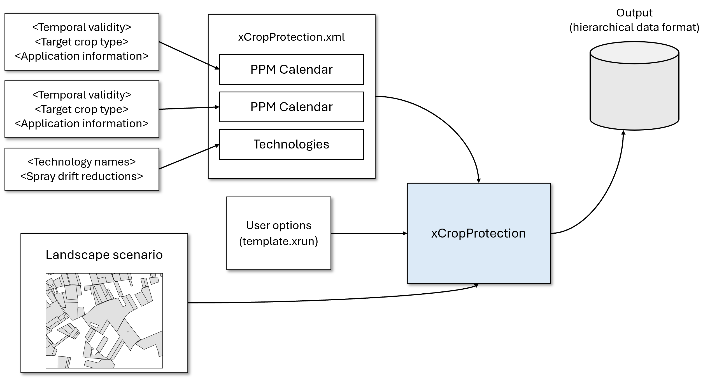
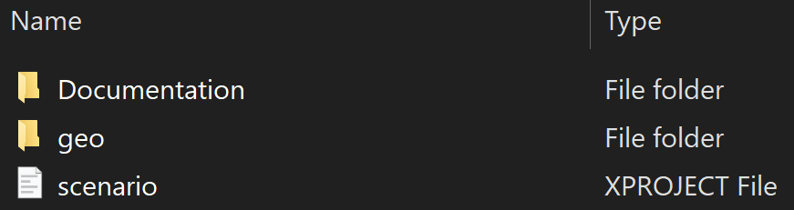
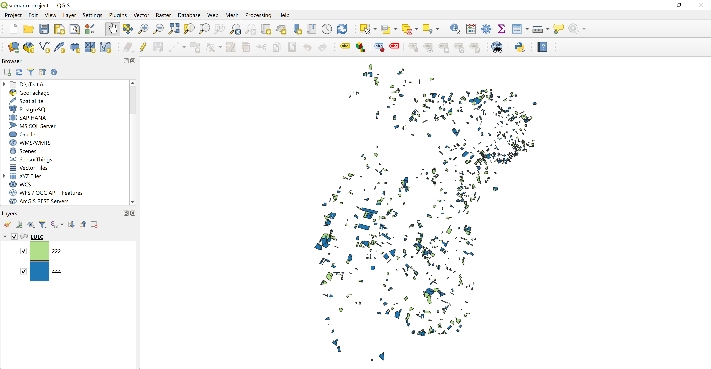
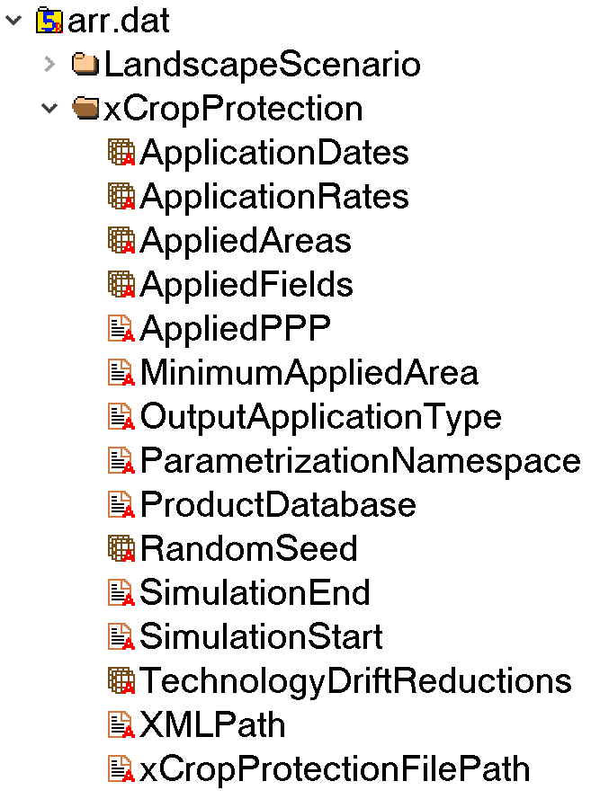

# Get started with xCropProtection

Goal: Create a scenario that represents a series of product applications to one crop class.

In this tutorial, you'll learn the basics of xCropProtection. You'll prepare a simulation using xCropProtection and recommendations for product applications for a specific pest.

!!! note
    In xCropProtection, the term **PPP use scenario** is used to describe a certain parameterization of xCropProtection including PPP application information, input/output scales, and temporal constraints. The term **landscape scenario** is used in the sense of a certain geographic region for which land use/cover, soil, weather, and habitat conditions have been defined as basis for landscape-scale pesticide exposure and effect modelling.

<figure>
    
  <figcaption>Illustration of the input to xCropProtection.</figcaption>
</figure>

## Requirements

* xCropProtection version 1.0
* [QGIS](https://www.qgis.org/) to view the landscape scenario
* [HDFView](https://www.hdfgroup.org/download-hdfview/)

## Explore the landscape scenario

1. Navigate to the *scenario/Demo-scenario* folder in your local installation of xCropProtection. In this folder, you will find a *Documentation* folder, a *geo* folder, and a *scenario.xproject* file.

    

    Open the *Documentation* folder which includes an image of the scenario, as well as a QGIS project containing the scenario.

2. Open the QGIS project.

    

    You can use this project to explore the landscape scenario and inspect individual fields. Any changes you make to the LULC layer will affect the dataset used as input to xCropProtection.

    Open the layer's attribute table. There are 1,000 fields in this scenario, 500 have the LULC type 222 and 500 have the LULC type 444. Take note of the fields ALVID and LULCTypeID. ALVID serves as a unique identifier for each feature, and LULCTypeID defines the land use type for each feature. Leave the project open, as we will refer to it later in this section.

3. Back in the *Demo-scenario* folder, open the geo folder. This folder holds the spatial data for the scenario as well as the *package.xinfo* file. Opening *package.xinfo*, you will see some information about the shapefile. Specifically, `base_landscape_geometries`, `feature_id_attribute`, and `feature_type_attribute` are important to simulation runs. `base_landscape_geometries` refers to the name of the target shapefile, including the .shp extension. `feature_id_attribute` must be the same as the name of the field in the `base_landscape_geometry`'s attribute table that provides a unique identifier for each feature. The type of this field must be an integer. Similarly, `feature_type_attribute` must be the same as the name of the field in the `base_landscape_geometry`'s attribute table that identifies the land use type of each feature. You can see how the XML attributes in *package.xinfo* match the values in the open attribute table in the QGIS project. Close the QGIS project once you are done exploring the landscape scenario.

4. Navigate back to the *Demo-scenario* folder and open the file named *scenario.xproject*. This file contains metadata about the scenario and should be updated whenever there are changes to the scenario files.

Now that you understand the landscape scenario, it is time to prepare input to xCropProtection.

## Create the Plant Protection Measure (PPM) Calendars

First, we will write the PPM Calendars for the PPP use scenario. PPM Calendars are XML files representing Plant Protection Measures and are composed of one or more Indications (measures to protect crops from certain pests). In xCP, an Indication is an explicit part of its parameterization. You can think of `Indication` elements, technically, as collections of `ApplicationSequence` elements. If more than one Application Sequence is defined in an Indication, these sequences are considered alternative Application sequences ("OR" related). The xCP parameterization entity Indication can be used to define alternative PPP use pattern, e.g., reflecting product market shares or fractions of biological or organic pest control means. Multiple Indications can be defined in an xCP parameterization, as many as necessary to represent a simple or complex real-world PPP use pattern in one or many crops. In this tutorial, we will be creating a very simple PPP use pattern.

<figure>
  
  <figcaption>Structure of a PPM Calendar</figcaption>
</figure>

The most important things to know are that PPM Calendars apply to one land use type (called the target crop type) **and** you should create unique PPM Calendars for each use scenario. The target crop type of a calendar is a numeric value corresponding to a numeric land use type in the landscape scenario (`feature_type_attribute`). 

1. Navigate to the *CropProtection* folder from the root of the repository. Open the folder *PPMCalendars* where you will see multiple other folders, each containing one or more PPM Calendars. Create a folder for your PPM Calendars named *Tutorial-calendars*. Open that folder.
2. Open the Notepad application to start writing your XML file. If you have an application with auto-complete or other text functions like Visual Studio Code, you can also use those to write XML files. Each PPM Calendar starts by defining the root element, `PPMCalendar`. Add the following lines to your file
    ``` xml
    <PPMCalendar xmlns="urn:xCropProtectionLandscapeScenarioParametrization">

    </PPMCalendar>
    ```
    Everything we write in PPM Calendars should fall between the opening and closing tags that we just added. Next we need to determine the `TemporalValidity`, `TargetCropType`, and `TargetField` values. Let's say that this calendar should be applied every year that the simulation runs, so we will add the following line **between** the opening and closing PPMCalendar tags. Indentation is not necessary but makes XML files easier to read.
    ``` xml
    <PPMCalendar xmlns="urn:xCropProtectionLandscapeScenarioParametrization">
        <TemporalValidity scales="time/simulation"> always </TemporalValidity>
    </PPMCalendar>
    ```
    The next two options restrict either the crop type or the field/feature ID that this calendar can be applied to. You can specify one or both, but in this case we will only define `TargetCropType`. Any PPP applications defined in this calendar will only apply to fields/features with the LULC type 222.
    ```xml
    <PPMCalendar xmlns="urn:xCropProtectionLandscapeScenarioParametrization">
        <TemporalValidity scales="time/simulation"> always </TemporalValidity>
        <TargetCrops type="list[int]" scales="global"> 222 </TargetCrops>
    </PPMCalendar>
    ```
3. Define `Indication` elements and `ApplicationSequence` elements. An `Indications` element always needs to enclose `Indication` elements; it can be thought of as a collection of multiple `Indication` elements.
    ```xml
    <PPMCalendar xmlns="urn:xCropProtectionLandscapeScenarioParametrization">
        <TemporalValidity scales="time/simulation"> always </TemporalValidity>
        <TargetCrops type="list[int]" scales="global"> 222 </TargetCrops>
        <Indications>
            <Indication type="xCropProtection.ChoiceDistribution" scales="time/year, space/base_geometry">
            </Indication>
        </Indications>
    </PPMCalendar>
    ```
    You will notice that the `Indication` element has a type of "xCropProtection.ChoiceDistribution". This means that only one of its child elements will be chosen to be applied (sampled for each field and year). It also means that probability values need to be defined for each child element. In this tutorial, this `Indication` represents the possible response to Mullein bugs in apples and we will provide two product options.
    ```xml
    <PPMCalendar xmlns="urn:xCropProtectionLandscapeScenarioParametrization">
        <TemporalValidity scales="time/simulation"> always </TemporalValidity>
        <TargetCrops type="list[int]" scales="global"> 222 </TargetCrops>
        <Indications>
            <Indication type="xCropProtection.ChoiceDistribution" scales="time/year, space/base_geometry">
                <ApplicationSequence probability="0.65">
                </ApplicationSequence>
                <ApplicationSequence probability="0.35">
                </ApplicationSequence>
            </Indication>
        </Indications>
    </PPMCalendar>
    ```
4. Now that the `ApplicationSequence` elements have been defined, we can add `Application` elements for each sequence. An `ApplicationSequence` can have one or more `Application` elements, and if an `ApplicationSequence` is sampled, each `Application` in the sequence will be applied to the field.
    ```xml
    <PPMCalendar xmlns="urn:xCropProtectionLandscapeScenarioParametrization">
        <TemporalValidity scales="time/simulation"> always </TemporalValidity>
        <TargetCrops type="list[int]" scales="global"> 222 </TargetCrops>
        <Indications>
            <Indication type="xCropProtection.ChoiceDistribution" scales="time/year, space/base_geometry">
                <ApplicationSequence probability="0.65">
                    <Application>
                        <Tank>
                            <Products type="list[str]" scales="other/products">
                                Admire
                            </Products>
                            <ApplicationRates scales="other/products">
                                <ApplicationRate type="float" unit="g/ha" scales="global">
                                    380
                                </ApplicationRate>
                            </ApplicationRates>
                        </Tank>
                        <ApplicationWindow type="xCropProtection.MonthDaySpan" scales="global">
                            05-01 to 05-10
                        </ApplicationWindow>
                        <Technology scales="global">Drift reduction nozzle</Technology>
                        <InCropBuffer type="float" unit="m" scales="global">0</InCropBuffer>
                        <InFieldMargin type="float" unit="m" scales="global">0</InFieldMargin>
                    </Application>
                </ApplicationSequence>
                <ApplicationSequence probability="0.35">
                    <Application>
                        <Tank>
                            <Products type="list[str]" scales="other/products">
                                Calypso
                            </Products>
                            <ApplicationRates scales="other/products">
                                <ApplicationRate type="float" unit="g/ha" scales="global">
                                    217
                                </ApplicationRate>
                            </ApplicationRates>
                        </Tank>
                        <ApplicationWindow type="xCropProtection.MonthDaySpan" scales="global">
                            05-01 to 05-10
                        </ApplicationWindow>
                        <Technology scales="global">Drift reduction nozzle</Technology>
                        <InCropBuffer type="float" unit="m" scales="global">0</InCropBuffer>
                        <InFieldMargin type="float" unit="m" scales="global">0</InFieldMargin>
                    </Application>
                </ApplicationSequence>
            </Indication>
        </Indications>
    </PPMCalendar>
    ```
    In this step we have added one `Application` to each `ApplicationSequence`. This means that every year, each field with the LULC type 222 will have a 65% chance of receiving an application of Admire, and a 35% chance of receiving an application of Calypso. For further exploration on this example, see [this page](intro-example.md)
5. Save this file as *tutorial-LULC-222.xml* in the *Tutorial-calendars* folder.

## Create the xCropProtection.xml file

1. Navigate to the *CropProtection* folder from the root of the repository and open the Notepad application. We now need to create the *xCropProtection.xml* file. This file stores the location of PPM Calendars that will be used in an xCropProtection simulation as well as spray-drift reduction values for technologies.
2. This file starts with an `xCropProtection` element. The attributes of this element do not need to be changed by users and can be copied from the documentation for any file you create.
    ```xml
    <xCropProtection xmlns="urn:xCropProtectionLandscapeScenarioParametrization" 
        xmlns:xsi="http://www.w3.org/2001/XMLSchema-instance"
        xsi:schemaLocation="urn:xCropProtectionLandscapeScenarioParametrization ../model/core/components/xCropProtection/xCropProtection.xsd">
    </xCropProtection>
    ```
3. The two main elements of this file are PPM Calendars, represented as file paths to *PPMCalendar.xml* files, and Technologies, represented as `Technology` elements. `Technology` elements may also be provided in a separate file, however, in this tutorial we will include them in this file.
    ```xml
    <xCropProtection xmlns="urn:xCropProtectionLandscapeScenarioParametrization" 
        xmlns:xsi="http://www.w3.org/2001/XMLSchema-instance"
        xsi:schemaLocation="urn:xCropProtectionLandscapeScenarioParametrization ../model/core/components/xCropProtection/xCropProtection.xsd">
        <PPMCalendars>
        </PPMCalendars>
        <Technologies>
        </Technologies>
    </xCropProtection>
    ```
4. Add a `PPMCalendar` element for each PPM Calendar that you would like to include. Here, we add one calendar pointing to the file we just created.
    ```xml
    <xCropProtection xmlns="urn:xCropProtectionLandscapeScenarioParametrization" 
        xmlns:xsi="http://www.w3.org/2001/XMLSchema-instance"
        xsi:schemaLocation="urn:xCropProtectionLandscapeScenarioParametrization ../model/core/components/xCropProtection/xCropProtection.xsd">
        <PPMCalendars>
            <PPMCalendar include="PPMCalendars/Tutorial-calendars/tutorial-LULC-222.xml"/>
        </PPMCalendars>
        <Technologies>
        </Technologies>
    </xCropProtection>
    ```
5. Add a `Technology` element for each unique `Technology` value in the included PPM Calendars. In this tutorial, we only had one technology named "Drift reduction nozzle". Each different technology needs a value for the spray-drift reduction that occurs from using this technology (as a fraction).
    ```xml
    <xCropProtection xmlns="urn:xCropProtectionLandscapeScenarioParametrization" 
        xmlns:xsi="http://www.w3.org/2001/XMLSchema-instance"
        xsi:schemaLocation="urn:xCropProtectionLandscapeScenarioParametrization ../model/core/components/xCropProtection/xCropProtection.xsd">
        <PPMCalendars>
            <PPMCalendar include="PPMCalendars/Tutorial-calendars/tutorial-LULC-222.xml"/>
        </PPMCalendars>
        <Technologies>
            <Technology>
                <TechnologyName scales="global">Drift reduction nozzle</TechnologyName>
                <DriftReduction type="float" unit="1" scales="global">0.2</DriftReduction>
            </Technology>
        </Technologies>
    </xCropProtection>
    ```

Save this file as *xCropProtection-tutorial.xml* in the *CropProtection* folder.

## Configure the user parameters

Next, we will configure the landscape model parameterization for this PPP use scenario. It is recommended to copy an existing landscape model parameterization file located in the root of the repository and change parameter values, rather than writing everything from scratch.

1. Copy the text of an XRUN file to a new file named *tutorial-configuration.xrun*.
2. Change the following elements:
    - `Modeller`: Your name or initials
    - `Project`: The name of the scenario, *scenario/Demo-scenario*. Be sure to include the *scenario* folder name
    - `CropProtectionScenario`: xCropProtection-tutorial.xml (including .xml)
    - `OutputApplicationType`: This defines whether the output of xCropProtection has the scale product or active substance. This should be set to product for this demo
    - `SimulationStart` and `SimulationEnd`: Set these to any two dates (with `SimulationStart` occurring before `SimulationEnd`). For this tutorial, it is recommended to simulate only 1 year.
    - `SimID`: Should be a short, descriptive string that represents this simulation. The SimID cannot be the same as any already existing simulation run in the *run* folder. For this tutorial, use *tutorial-run*
3. Any elements not listed here should remain as they are.
4. Save this file.

## Run xCropProtection

1. Drag *tutorial-configuraion.xrun* onto *__start_\__.bat* to run xCropProtection with the parameterization you have just generated.
2. Once the simulation is finished, navigate to *run/tutorial-run/mcs/[MC ID]/store* to find the output of the xCropProtection simulation. Open the file *arr.dat* with HDFView. Expand the xCropProtection section.

    

    You can explore each of these datasets by right clicking on each and selecting "Open".
3. To export the results to a csv for easier inspection, first close *arr.dat* and copy its file path. Navigate to the *analysis* folder and open *xCP_write_csv.ipynb*.
4. Set `xcrop_arrdat_path` to *arr.dat*'s file path. Set `output_path` to the desired csv output location. Follow instructions in xCropProtection's `README` for installing Python and the notebook requirements.
4. Open the result of *xCP_write_csv.ipynb* to see a csv of applications that occurred during the simulation. Viewing the csv results can be more easy to understand than directly viewing the output file.

This tutorial has been a walkthrough of how to prepare a scenario for xCropProtection. To start creating more complex PPP use scenarios, see the [Templates](../xCropProtection-templates/templates-intro.md) section to learn more.