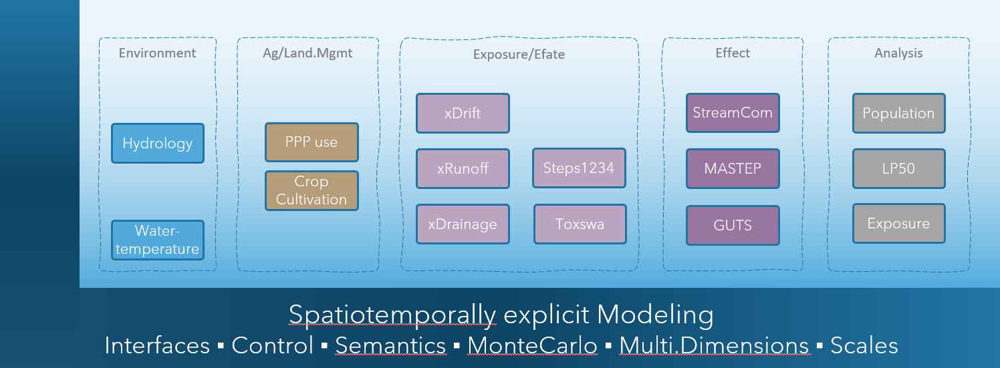

# xLandscape

**xLandscape is not a model**. It's **a modular framework** that allows **to build models**. The models to build are typically intended to simulate processes (phenomenons) in **real-world landscapes**.  
Therefore, the ***core*** of the xLandscape approach implements characteristics of **spatiotemporally eXplicit** modelling using geoinformation. Beyond space and time, further dimensions and scales are explicitly represented. The prefix ***x*** shall indicate this. This design intends to simulate pattern of real-world landscape conditions using a *Monte Carlo* approach.  
Another fundamental principle is that xLandscape has a **modular design**. Modules are called ***components*** as the software architecture is based on *Component-Based Software Enginieering* (CBSE). The graphic below shows the **composition** of a catchment-scale model *xAquatic* (Github: [xAquatic](https://github.com/xlandscape/xAquaticRisk)).  

The **current major release level is *1.x***, which essentially means that we have a working software available that implements the key design and  essential requirements. The [Vision](#vision) below explains where we want to go to. xLandscape is **open source** (Github: [xLandscape](https://github.com/xlandscape), see the xLandscape [README](https://github.com/xlandscape/LandscapeModel-Core/blob/master/README.md) for technical details and instructions).  

  

*Illustration of a model composition using the xLandscape framework. The ***core*** is represented by the framing 'L' (dark blue). The boxes represent **components** (eg, 'xDrift') of specific functionality. The composition make a model, here xAquatic which simulates pesticide use in catchments, exposure of streams, pesticide transport and fate in streams, as well as effects to aquatic invertebrate species*. The integration assures inner consistancy of data and semantics (indicated by the light blue backgroud).  

For futher information you might contact Thorsten Schad (mailto:thorsten.schad@bayer.com) or Sascha Bub (mailto:sascha.bub@rptu.de).  

## Vision

### *in what situation did we start?!*

In the 2000s, pesticide risk assessment was largely based on a combination of **conservative (worst-case) exposure scenarios and ecotoxicological testing conditions**. Although this risk assessment design assures a high level of protectiveness, it does not allow to define effective and efficient risk management measures, nor does it provide approaches in cases where unacceptable risk was indicated for worst-case conditions.  
The need for more realistic risk assessment was also identified in different **pesticide risk assessment related workgroups** (eg, European Workshop on Probabilistic Risk Assessment for the Environmental Impacts of PPPs (EUPRA, Hart 2001), FOCUS Landscape and Mitigation (FOCUS 2007a, 2007b)), as well as in more **generic initiatives** (eg, Water Framework Directive (WFD, EC 2000), Sustainable Use Directive (EC 2009b), United Nations 'Millennium Ecosystem Assessment' (2005)).  
In a phase of improved availability of environmental (geo)data together with the establishment of mechanistic models (eg, [EC/Joined Research Centre](https://esdac.jrc.ec.europa.eu/projects/surface-water)), **early approaches** were built for more realistic exposure and risk assessment at landscape-level (eg, [Almass](https://projects.au.dk/almass/publications), [IVA/GeoPERA](https://www.york.ac.uk/media/environment/documents/people/brown/schad.pdf), [Julius-Kühn-Institut/GIS](https://www.openagrar.de/receive/openagrar_mods_00058550), [UBA/GeoRISK](https://www.umweltbundesamt.de/publikationen/georeferenced-probabilistic-risk-assessment-of)). Although significant progress was made, these early approaches had particular deficiencies in how naturally given variability was propagated to outcome (resulting in unrealstic system conditions) and tended to be rather large and intransparent monoliths. The models were not publically available and interoperability was not possible.  
A stepping stone towards addressing these shortcomings and so, recent developments was provided with the **Xplicit** approach ([Schad & Schulz 2011](https://pubmed.ncbi.nlm.nih.gov/21538833/), [Schad 2013](https://portal.dnb.de/opac.htm?method=simpleSearch&cqlMode=true&query=idn%3D1037920015)). Xplicit intended to reproduce natural pattern of exposure in space and time and to get more modular and open. Xplicit was applied to a range of pesticide risk assessment studies.  

  

*Illustration of the application of **xplicit** to a NTA study in hops in Germany (Fachökotox-Tagung Landau 2010)*  

### *current developments and future directions*

In recent years, **the demand for more realistic and holistic risk assessment of pesticide, their more targeted use and integrated pest control has ever increased** (eg, [EU Green Deal](https://commission.europa.eu/strategy-and-policy/priorities-2019-2024/european-green-deal_en), [EU Farm-to-Fork](https://food.ec.europa.eu/horizontal-topics/farm-fork-strategy_en), [EC Biodiversity Strategy](https://environment.ec.europa.eu/strategy/biodiversity-strategy-2030_en), [EC Nature Restoration Law](https://environment.ec.europa.eu/topics/nature-and-biodiversity/nature-restoration-law_en), [UNEP](https://www.unep.org/news-and-stories/press-release/new-initiative-aims-curb-toxic-impacts-agriculture), [Endangered Species](https://www.fws.gov/law/endangered-species-act), [Reduction of Pesticide Use (JRC)](https://joint-research-centre.ec.europa.eu/jrc-news-and-updates/reducing-pesticide-use-more-data-and-innovative-solutions-needed-2024-07-04_en), [EC Protection of Bees](https://food.ec.europa.eu/plants/pesticides/protection-bees_en), [EC Integrated Pest Management](https://food.ec.europa.eu/plants/pesticides/sustainable-use-pesticides/integrated-pest-management-ipm_en), [Mixture Toxicity](https://enveurope.springeropen.com/articles/10.1186/s12302-022-00594-3)). These are **global trends** and already **ongoing implementations**.  
Simultaneously, **data availability** has been increased whilst cost were reduced (eg, [EEA Data Hub](https://www.eea.europa.eu/en/datahub), [EU Crop Cover](https://joint-research-centre.ec.europa.eu/jrc-news-and-updates/eu-crop-map-2021-10-18_en), [BDTOPO France](https://geoservices.ign.fr/bdtopo), [Biodiversity](https://www.gbif.org/), [Species Monitoring](https://datasources.speciesmonitoring.org/)), especially with **remote sensing** and related data preparation workflows (eg [Copernicus](https://www.copernicus.eu/en), [Google Earth Engine](https://earthengine.google.com/), [Drones](https://openaerialmap.org/)). **Computing** ressources have been increased significanty. With **effect modelling** (eg, [ModelLink](https://setac.onlinelibrary.wiley.com/doi/10.1002/ieam.1704), [Good Modelling Practice](https://www.efsa.europa.eu/en/efsajournal/pub/3589)) model  predictions have reached the level of species' populations and ecosystems. Accross topics and initiatives we increasingly see an ***open source* culture**.  

Todays' demands for modelling systems range from scenario-based integrated landscape models up to digital twins (eg, [BioDT](https://biodt.eu/), [Destination Earth](https://destination-earth.eu/)).  

  

*EU Digital Twin (DestinE), as an illustration for a vision to integrate data and models of different topics to build a new model to simulate real-world phenomenons for decision support. Individual contributions are made according to individual domain expertise. A loop of monitoring and modelling improves the system.*  

> Given the complexity of real-world systems, hence approaches, together with the range of disciplines needed,  
> it is no longer advisable, nor justifiable, to try real-world (landscape) modelling in isolation - **Collaboration is the paradigm.**  

### *today - applicable landscape models needed*

Today, the **landscape level has been established in pesticide RA** throughout species groups (eg, aquatic, nta, bees, ntp, birds, mammals,endangered species) and global regions. This, either as an explicit RA level (eg, [EFSA Aquatic Guidance](https://www.efsa.europa.eu/en/efsajournal/pub/3290), graphic below) or implicitely as to provide the real-world context for system behavious (eg, population recovery option [EFSA Recovery Option](https://efsa.onlinelibrary.wiley.com/doi/abs/10.2903/j.efsa.2016.4313)). Beyond actual RA, this is accompanied by numerous research activities towards holistic RA in the regulatory scientific community (eg, global conference progams of the Society of Environmental Toxicology and Chemistry, [SETAC](https://www.setac.org/)).  
> Landscape modelling approaches are needed to address these demands. However, heterogeneous complex approaches for each and every study question are unlikely to succeed in the long run. **An open, modular, and so collaborative approach seems more promising.**  

  

*[EFSA Aquatic Guidance](https://www.efsa.europa.eu/en/efsajournal/pub/3290) Tier4 landscape risk assessment level*  

[Experiance](#in-what-situation-did-we-start) together with [future directions](#current-developments-and-future-directions) (above) set the scene for making steps towards **a next generation landscape modelling approach:**  

**General requirements and design principles:**  

1. A **modular** approach that allows to integrate existing models into a landscape modelling context.  
1. The integration assures (inner) **data and information consistancy**, making use of *semantics*.  
1. Modules can be developed by everyone. External modules (the actual function-providing models) become integrated **components** using a *wrapper*.  
1. A **core** implements the key landscape modelling functionality and semantics (not more). Modules interact with the core.  
1. The **composed landscape model** appears to the user as any other model, ie it takes inputs (parameterisation, data) and generates outputs.  
1. The implementation process is **agile**. It is driven by todays' demands (*working product*) whilst being adaptable in the frame of anticipated developments.  

**Landscape Modelling requirements and design principles**:

1. The landscape model works discrete (numeric). Its core dimensions are space and time. It is **spatiotemporally explicit**. 
1. Further modelling **dimensions** can be introduced by the modelled topics, eg, exposure (of different landscape entities) and effects (and their *Specific Protection Goals* dimensions, eg, biological entity and attributes).
1. Landscape modelling comes with a strong **spatial** perception ('maps'). Spatial entities can be represented in any format (eg, raster, vector), scales and shape. Data extent is only limited by computing ressources. The model core, together with corresponding components (modules) inputs external data into inner data stores, which operates semantically-enriched and assures data consistency throughout consuming components. 
1. Likewise, the **temporal dimension** can use the units as needed to represent dynamics of the modelled systems. These can be different in the different *components*.
1. Data for this multidimensional modelling are held in a **multidimensional datastore**. The technical representation is independent from the conceptual, ie different data store technologies can be used.
1. The Landscape Model basically implements a **Monte Carlo** approach. This allows to propagate variabilities (uncertainties) of the natural system (eg, land use, PPP use, weather conditions) to variabilities of the outcome (eg, exposure, effects to organisms). 
1. The model works with **Semantics** to assure mutual *'understanding'* of data and models. Semantics are stepwise implemented, starting with physical units, scales and metadata, and are developed up to the use of *ontologies*. 
1. The model is open to introduce new entities, scales and units.
1. The design is based on ***Component Based Software Engineering*** (CBSE). The ***core*** is considered to work as a *microkernel*, the *components* represent the models that bring the actual functionality.

**further aspects**:

1. Given its fundamental context, the design of the Landscape Model has at least **roots in pesticide risk assessment and risk management** (decision support) and related topics like landscape biodiversity enhancements. It is build for use in the **regulatory scientific community**.  
1. *Components* and their inner models (modules) can be **data-driven, mechanistic or hybrid**.  
1. A common and easy to learn programming language is used for the implementation of the *core* and its functionality. **Phyton** was selected for this. However, *components* (moduls) can be implemented in basically any language (eg, C, C++, Go, netlogo). The same applies to *core* functionalities that might have specific needs, eg for speed or parallelisation.  
1. A basic paradigm is **scalability**. Basically, the spatial and temporal extent of simulations shall not be limited by design, but only by given computing ressources.
1. The development, use and work around a Landscape Model come with differnt roles. **Roles** have a specific purpose and require different skills, documentation, and traing. Thus, *roles* need an explicit awareness and definition: eg, 'Core Developer', 'Module Developer', 'Landscape Model Builder', 'Landscape Model User (expert, trained)', 'API Consumer'.
1. During initial development phase, the Landscape Model **usability** mainly addresses the *expert* user, ie those who know the purpose, have experiance with modelling on a technical level (eg, understanding the meaning of a certain parameterisation, using xml). Of course, **Graphical User Interfaces** (eg, an Integrated Development Environment (IDE) for Landscape Model composition) and **web-browser-based** interaction (eg, for Landscape Model execution and analysis) is important and envisaged.
1. The implementation shall make use of modern **versioning** and **collaboration** approaches and systems (eg, [Github](https://github.com/xlandscape)).
1. The development shall not be done in isolation, but of **open minded culture** (agile). Whilst trying to get a working product, continued exchange with the communities and research on technologies facilitate adaptivity.
1. The products basically persue an **open source** culture and paradigm. This applies eg, to the Landscape Model *core* [xlandscape](https://github.com/xlandscape) and the majority of *components* and *Landscape Models* (eg, [xAquatic](https://github.com/xlandscape/xAquaticRisk)). However, due to insitutional licence policies some *components* might be **open access**, ie are open for use but without the source code of the actual model (eg, [Cascade-Toxswa](https://github.com/xlandscape/CascadeToxswa-Component)). Of course, the entire Landscape Modelling approach can be used for entirely internal and **private developments**. This allows hybrid Landscape Models for which some functionality can even get patented.  
1. Last but not least: **imagine** you are about to develop a specific population model, say an amphibian model, for pesticide RA. **Without a modular Landscape Modelling system** you'll need to develop anything outside your model yourself, eg, landscape environmental and agricultural scenarios, PPP use, exposure and efate. **With** such an approach, you can make use of all data and *components* available, add specific needs (eg, a microclimate model) and focus on your key model development. This is what is called *separation of concern*.  

>Remark: Intense research and trials to work within existing systems (eg, working within GIS systems, close to big-data spatial databases (eg rasdaman), Almass, OpenMI, and a range of related approaches) all ended up in dead ends for the purposes and needs of our work in environmental risk assessment, risk management and the more generic fields (as outlined above). This is why we indentified the need for own developments.
